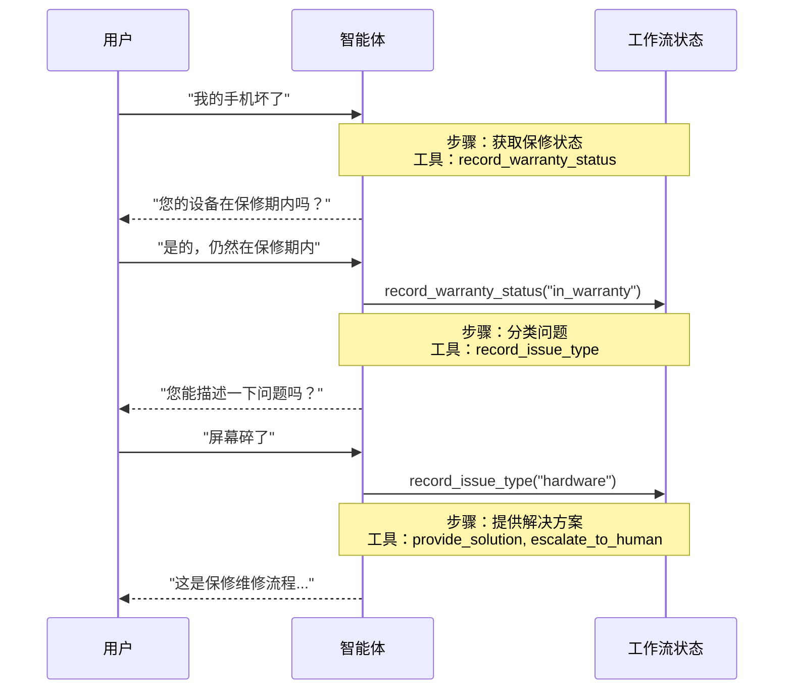

# 交接

在**交接**架构中，行为根据状态动态变化。核心机制：[工具](/oss/python/langchain/tools)更新跨轮次持久化的状态变量（例如 `current_step` 或 `active_agent`），系统读取此变量来调整行为——应用不同的配置（系统提示、工具）或路由到不同的[智能体](/oss/python/langchain/agents)。此模式支持不同智能体之间的交接以及单个智能体内的动态配置更改。

<Tip>
  **交接**一词由 [OpenAI](https://openai.github.io/openai-agents-python/handoffs/) 创造，用于使用工具调用（例如 `transfer_to_sales_agent`）在智能体或状态之间转移控制权。
</Tip>



## 关键特征

* **状态驱动行为**：行为根据状态变量变化（例如 `current_step` 或 `active_agent`）
* **基于工具的转换**：工具更新状态变量以在不同状态之间移动
* **直接用户交互**：每个状态的配置直接处理用户消息
* **持久化状态**：状态跨对话轮次存活

## 使用场景

当您需要强制执行顺序约束（仅在满足先决条件后解锁功能）、智能体需要在不同状态之间直接与用户对话，或正在构建多阶段对话流程时，使用交接模式。此模式对于客户支持场景特别有价值，您需要按特定顺序收集信息——例如在处理退款之前收集保修 ID。

## 基本实现

核心机制是一个[工具](/oss/python/langchain/tools)，它返回 [`Command`](/oss/python/langgraph/graph-api#command) 来更新状态，触发到新步骤或智能体的转换：

```python
from langchain.tools import tool
from langchain.messages import ToolMessage
from langgraph.types import Command

@tool
def transfer_to_specialist(runtime) -> Command:
    """转移到专家智能体。"""
    return Command(
        update={
            "messages": [
                ToolMessage(  # [!code highlight]
                    content="转移到专家",
                    tool_call_id=runtime.tool_call_id  # [!code highlight]
                )
            ],
            "current_step": "specialist"  # 触发行为更改
        }
    )
```

<Note>
  **为什么要包含 `ToolMessage`？** 当 LLM 调用工具时，它期望得到响应。带有匹配 `tool_call_id` 的 `ToolMessage` 完成这个请求-响应循环——没有它，对话历史就会变得畸形。每当您的交接工具更新消息时，这是必需的。
</Note>

有关完整实现，请参阅下面的教程。

**教程：使用交接构建客户支持**

学习如何使用交接模式构建客户支持智能体，其中单个智能体在不同配置之间转换。

## 实现方法

有两种实现交接的方法：**[带中间件的单智能体](#带中间件的单智能体)**（具有动态配置的一个智能体）或**[多智能体子图](#多智能体子图)**（作为图节点的独立智能体）。

### 带中间件的单智能体

单个智能体根据状态更改其行为。中间件拦截每个模型调用并动态调整系统提示和可用工具。工具更新状态变量以触发转换：

```python
from langchain.tools import ToolRuntime, tool
from langchain.messages import ToolMessage
from langgraph.types import Command

@tool
def record_warranty_status(
    status: str,
    runtime: ToolRuntime[None, SupportState]
) -> Command:
    """记录保修状态并转换到下一步。"""
    return Command(
        update={
            "messages": [
                ToolMessage(
                    content=f"保修状态已记录：{status}",
                    tool_call_id=runtime.tool_call_id
                )
            ],
            "warranty_status": status,
            "current_step": "specialist"  # 更新状态以触发转换
        }
    )
```

**完整示例：带中间件的客户支持：**

```python
from langchain.agents import AgentState, create_agent
from langchain.agents.middleware import wrap_model_call, ModelRequest, ModelResponse
from langchain.tools import tool, ToolRuntime
from langchain.messages import ToolMessage
from langgraph.types import Command
from typing import Callable

# 1. 定义带 current_step 跟踪器的状态
class SupportState(AgentState):  # [!code highlight]
    """跟踪当前活动的步骤。"""
    current_step: str = "triage"  # [!code highlight]
    warranty_status: str | None = None

# 2. 工具通过 Command 更新 current_step
@tool
def record_warranty_status(
    status: str,
    runtime: ToolRuntime[None, SupportState]
) -> Command:  # [!code highlight]
    """记录保修状态并转换到下一步。"""
    return Command(update={  # [!code highlight]
        "messages": [  # [!code highlight]
            ToolMessage(
                content=f"保修状态已记录：{status}",
                tool_call_id=runtime.tool_call_id
            )
        ],
        "warranty_status": status,
        # 转换到下一步
        "current_step": "specialist"    # [!code highlight]
    })

# 3. 中间件根据 current_step 应用动态配置
@wrap_model_call  # [!code highlight]
def apply_step_config(
    request: ModelRequest,
    handler: Callable[[ModelRequest], ModelResponse]
) -> ModelResponse:
    """根据 current_step 配置智能体行为。"""
    step = request.state.get("current_step", "triage")  # [!code highlight]

    # 将步骤映射到它们的配置
    configs = {
        "triage": {
            "prompt": "收集保修信息...",
            "tools": [record_warranty_status]
        },
        "specialist": {
            "prompt": "根据保修提供解决方案：{warranty_status}",
            "tools": [provide_solution, escalate]
        }
    }

    config = configs[step]
    request = request.override(  # [!code highlight]
        system_prompt=config["prompt"].format(**request.state),  # [!code highlight]
        tools=config["tools"]  # [!code highlight]
    )
    return handler(request)

# 4. 创建带中间件的智能体
agent = create_agent(
    model,
    tools=[record_warranty_status, provide_solution, escalate],
    state_schema=SupportState,
    middleware=[apply_step_config],  # [!code highlight]
    checkpointer=InMemorySaver()  # 跨轮次持久化状态  # [!code highlight]
)
```

### 多智能体子图

多个独立智能体作为图中的单独节点存在。交接工具使用 `Command.PARENT` 在智能体节点之间导航，以指定下一步执行哪个节点。

<Warning>
  子图交接需要仔细的[上下文工程](/oss/python/langchain/context-engineering)。与单智能体中间件（消息历史自然流动）不同，您必须明确决定哪些消息在智能体之间传递。如果处理不当，智能体会收到畸形的对话历史或膨胀的上下文。请参阅下面的[上下文工程](#上下文工程)。
</Warning>

```python
from langchain.messages import AIMessage, ToolMessage
from langchain.tools import tool, ToolRuntime
from langgraph.types import Command

@tool
def transfer_to_sales(
    runtime: ToolRuntime,
) -> Command:
    """转移到销售智能体。"""
    last_ai_message = next(  # [!code highlight]
        msg for msg in reversed(runtime.state["messages"]) if isinstance(msg, AIMessage)  # [!code highlight]
    )  # [!code highlight]
    transfer_message = ToolMessage(  # [!code highlight]
        content="转移到销售智能体",  # [!code highlight]
        tool_call_id=runtime.tool_call_id,  # [!code highlight]
    )  # [!code highlight]
    return Command(
        goto="sales_agent",
        update={
            "active_agent": "sales_agent",
            "messages": [last_ai_message, transfer_message],  # [!code highlight]
        },
        graph=Command.PARENT
    )
```

**完整示例：带交接的销售和支持：**

此示例展示了一个多智能体系统，具有单独的销售和支持智能体。每个智能体是单独的图节点，接手工具允许智能体相互转移对话。

```python
from typing import Literal

from langchain.agents import AgentState, create_agent
from langchain.messages import AIMessage, ToolMessage
from langchain.tools import tool, ToolRuntime
from langgraph.graph import StateGraph, START, END
from langgraph.types import Command
from typing_extensions import NotRequired


# 1. 定义带 active_agent 跟踪器的状态
class MultiAgentState(AgentState):
    active_agent: NotRequired[str]


# 2. 创建交接工具
@tool
def transfer_to_sales(
    runtime: ToolRuntime,
) -> Command:
    """转移到销售智能体。"""
    last_ai_message = next(  # [!code highlight]
        msg for msg in reversed(runtime.state["messages"]) if isinstance(msg, AIMessage)  # [!code highlight]
    )  # [!code highlight]
    transfer_message = ToolMessage(  # [!code highlight]
        content="从支持智能体转移到销售智能体",  # [!code highlight]
        tool_call_id=runtime.tool_call_id,  # [!code highlight]
    )  # [!code highlight]
    return Command(
        goto="sales_agent",
        update={
            "active_agent": "sales_agent",
            "messages": [last_ai_message, transfer_message],  # [!code highlight]
        },
        graph=Command.PARENT,
    )


@tool
def transfer_to_support(
    runtime: ToolRuntime,
) -> Command:
    """转移到支持智能体。"""
    last_ai_message = next(  # [!code highlight]
        msg for msg in reversed(runtime.state["messages"]) if isinstance(msg, AIMessage)  # [!code highlight]
    )  # [!code highlight]
    transfer_message = ToolMessage(  # [!code highlight]
        content="从销售智能体转移到支持智能体",  # [!code highlight]
        tool_call_id=runtime.tool_call_id,  # [!code highlight]
    )  # [!code highlight]
    return Command(
        goto="support_agent",
        update={
            "active_agent": "support_agent",
            "messages": [last_ai_message, transfer_message],  # [!code highlight]
        },
        graph=Command.PARENT,
    )


# 3. 创建带交接工具的智能体
sales_agent = create_agent(
    model="anthropic:claude-sonnet-4-20250514",
    tools=[transfer_to_support],
    system_prompt="你是销售智能体。帮助处理销售咨询。如果被问及技术问题或支持，请转移到支持智能体。",
)

support_agent = create_agent(
    model="anthropic:claude-sonnet-4-20250514",
    tools=[transfer_to_sales],
    system_prompt="你是支持智能体。帮助处理技术问题。如果被问及定价或购买，请转移到销售智能体。",
)


# 4. 创建调用智能体的节点
def call_sales_agent(state: MultiAgentState) -> Command:
    """调用销售智能体的节点。"""
    response = sales_agent.invoke(state)
    return response


def call_support_agent(state: MultiAgentState) -> Command:
    """调用支持智能体的节点。"""
    response = support_agent.invoke(state)
    return response


# 5. 创建路由器，检查我们是否应该结束或继续
def route_after_agent(
    state: MultiAgentState,
) -> Literal["sales_agent", "support_agent", "__end__"]:
    """根据 active_agent 路由，如果智能体在没有交接的情况下完成则结束。"""
    messages = state.get("messages", [])

    # 检查最后一条消息——如果是没有工具调用的 AIMessage，我们就完成了
    if messages:
        last_msg = messages[-1]
        if isinstance(last_msg, AIMessage) and not last_msg.tool_calls:  # [!code highlight]
            return "__end__"  # [!code highlight]

    # 否则路由到活动的智能体
    active = state.get("active_agent", "sales_agent")
    return active if active else "sales_agent"


def route_initial(
    state: MultiAgentState,
) -> Literal["sales_agent", "support_agent"]:
    """根据状态路由到活动的智能体，默认为销售智能体。"""
    return state.get("active_agent") or "sales_agent"


# 6. 构建图
builder = StateGraph(MultiAgentState)
builder.add_node("sales_agent", call_sales_agent)
builder.add_node("support_agent", call_support_agent)

# 从基于初始 active_agent 的条件路由开始
builder.add_conditional_edges(START, route_initial, ["sales_agent", "support_agent"])

# 在每个智能体之后，检查我们是否应该结束或路由到另一个智能体
builder.add_conditional_edges(
    "sales_agent", route_after_agent, ["sales_agent", "support_agent", END]
)
builder.add_conditional_edges(
    "support_agent", route_after_agent, ["sales_agent", "support_agent", END]
)

graph = builder.compile()
result = graph.invoke(
    {
        "messages": [
            {
                "role": "user",
                "content": "嗨，我登录账户时遇到问题。您能帮助吗？",
            }
        ]
    }
)

for msg in result["messages"]:
    msg.pretty_print()
```

<Tip>
  对于大多数交接用例，使用**带中间件的单智能体**——它更简单。仅当您需要自定义智能体实现（例如，本身是带有反思或检索步骤的复杂图的节点）时，才使用**多智能体子图**。
</Tip>

#### 上下文工程

使用子图交接，您可以精确控制哪些消息在智能体之间流动。这种精确性对于维护有效的对话历史和避免可能使下游智能体混淆的上下文膨胀至关重要。关于此主题的更多信息，请参阅[上下文工程](/oss/python/langchain/context-engineering)。

**处理交接期间的上下文**

在智能体之间交接时，您需要确保对话历史保持有效。LLM 期望工具调用与其响应配对，因此当使用 `Command.PARENT` 交接给另一个智能体时，您必须同时包含两者：

1. **包含工具调用的 `AIMessage`**（触发交接的消息）
2. **确认交接的 `ToolMessage`**（该工具调用的人工响应）

没有这种配对，接收智能体将看到不完整的对话历史，并可能产生错误或意外行为。

以下示例假设只调用了交接工具（没有并行工具调用）：

```python
@tool
def transfer_to_sales(runtime: ToolRuntime) -> Command:
    # 获取触发此交接的 AI 消息
    last_ai_message = runtime.state["messages"][-1]

    # 创建人工工具响应来完成配对
    transfer_message = ToolMessage(
        content="转移到销售智能体",
        tool_call_id=runtime.tool_call_id,
    )

    return Command(
        goto="sales_agent",
        update={
            "active_agent": "sales_agent",
            # 仅传递这两条消息，而不是完整的子智能体历史
            "messages": [last_ai_message, transfer_message],
        },
        graph=Command.PARENT,
    )
```

<Note>
  **为什么不传递所有子智能体消息？** 虽然您可以在交接中包含完整的子智能体对话，但这通常会产生问题。接收智能体可能会被不相关的内部推理所混淆，并且令牌成本不必要地增加。通过仅传递交接配对，您使父图的上下文专注于高级协调。如果接收智能体需要额外上下文，考虑在 ToolMessage 内容中总结子智能体的工作，而不是传递原始消息历史。
</Note>

**将控制权返回给用户**

当将控制权返回给用户（结束智能体的轮次）时，确保最终消息是 `AIMessage`。这保持有效的对话历史，并向用户界面信号智能体已完成其工作。

## 实现考虑

在设计多智能体系统时，请考虑：

* **上下文过滤策略**：每个智能体是否接收完整的对话历史、过滤的部分或摘要？不同的智能体可能根据其角色需要不同的上下文。
* **工具语义**：澄清交接工具是否仅更新路由状态或也执行副作用。例如，`transfer_to_sales()` 是否也应该创建支持工单，或者那应该是单独的操作？
* **令牌效率**：平衡上下文完整性对抗令牌成本。随着对话变长，总结和选择性上下文传递变得更加重要。

