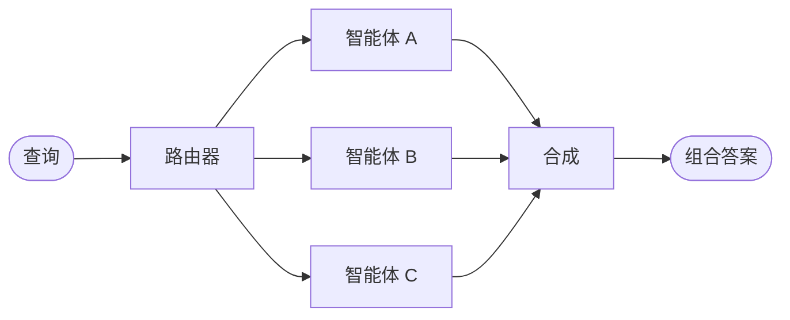

# 路由器

在**路由器**架构中，路由步骤对输入进行分类并将其定向到专门的[智能体](/oss/python/langchain/agents)。当您有独立的**垂直领域**——每个都需要自己的智能体的独立知识域时，这很有用。



## 关键特征

* 路由器分解查询
* 零个或多个专门智能体并行调用
* 结果被合成为连贯的响应

## 使用场景

当您有独立的垂直领域（每个都需要自己的智能体的独立知识域）、需要并行查询多个来源，并希望将结果合成为组合响应时，使用路由器模式。

## 基本实现

路由器对查询进行分类并将其定向到适当的智能体。使用 [`Command`](/oss/python/langgraph/graph-api#command) 进行单智能体路由或 [`Send`](/oss/python/langgraph/graph-api#send) 进行并行扇出到多个智能体。

**单智能体：**

使用 `Command` 路由到单个专门智能体：

```python
from langgraph.types import Command

def classify_query(query: str) -> str:
    """使用 LLM 对查询进行分类并确定适当的智能体。"""
    # 分类逻辑在这里
    ...

def route_query(state: State) -> Command:
    """根据查询分类路由到适当的智能体。"""
    active_agent = classify_query(state["query"])

    # 路由到选定的智能体
    return Command(goto=active_agent)
```

**多智能体（并行）：**

使用 `Send` 并行扇出到多个专门智能体：

```python
from typing import TypedDict
from langgraph.types import Send

class ClassificationResult(TypedDict):
    query: str
    agent: str

def classify_query(query: str) -> list[ClassificationResult]:
    """使用 LLM 对查询进行分类并确定调用哪些智能体。"""
    # 分类逻辑在这里
    ...

def route_query(state: State):
    """根据查询分类路由到相关智能体。"""
    classifications = classify_query(state["query"])

    # 并行扇出到选定的智能体
    return [
        Send(c["agent"], {"query": c["query"]})
        for c in classifications
    ]
```

有关完整实现，请参阅下面的教程。

**教程：使用路由构建多源知识库**

构建一个并行查询 GitHub、Notion 和 Slack 的路由器，然后将结果合成为连贯的答案。涵盖状态定义、专门智能体、使用 `Send` 的并行执行和结果合成。

## 无状态 vs. 有状态

两种方法：

* [**无状态路由器**](#无状态) 独立处理每个请求
* [**有状态路由器**](#有状态) 跨请求维护对话历史

## 无状态

每个请求独立路由——调用之间没有记忆。关于多轮对话，请参阅[有状态路由器](#有状态)。

<Tip>
  **路由器 vs. 子智能体**：两种模式都可以将工作分派给多个智能体，但它们在路由决策的方式上有所不同：

  * **路由器**：专门的路由步骤（通常是单个 LLM 调用或基于规则的逻辑）对输入进行分类并分派给智能体。路由器本身通常不维护对话历史或执行多轮编排——它是一个预处理步骤。
  * **子智能体**：主监督智能体动态决定在持续对话中调用哪些[子智能体](/oss/python/langchain/multi-agent/subagents)。主智能体维护上下文，可以在多轮中调用多个子智能体，并编排复杂的多步骤工作流。

  当您有清晰的输入类别并想要确定性或轻量级分类时，使用**路由器**。当您需要灵活的、感知对话的编排时使用**监督者**，其中 LLM 根据不断发展的上下文决定下一步做什么。
</Tip>

## 有状态

对于多轮对话，您需要跨调用维护上下文。

### 工具包装器

最简单的方法：将无状态路由器包装为对话智能体可以调用的工具。对话智能体处理内存和上下文；路由器保持无状态。这避免了跨多个并行智能体管理对话历史的复杂性。

```python
@tool
def search_docs(query: str) -> str:
    """搜索多个文档来源。"""
    result = workflow.invoke({"query": query})  # [!code highlight]
    return result["final_answer"]

# 对话智能体将路由器用作工具
conversational_agent = create_agent(
    model,
    tools=[search_docs],
    prompt="您是一个有用的助手。使用 search_docs 来回答问题。"
)
```

### 完整持久化

如果您需要路由器本身维护状态，请使用[持久化](/oss/python/langchain/short-term-memory)来存储消息历史。当路由到智能体时，从状态中获取先前的消息并选择性地将它们包含在智能体的上下文中——这是[上下文工程](/oss/python/langchain/context-engineering)的一个杠杆。

<Warning>
  **有状态路由器需要自定义历史管理。** 如果路由器在轮次之间在智能体之间切换，当智能体有不同的语气或提示时，对话对最终用户可能不会感觉流畅。使用并行调用，您需要在路由器级别维护历史（输入和合成的输出）并在路由逻辑中利用此历史。考虑[交接模式](/oss/python/langchain/multi-agent/handoffs)或[子智能体模式](/oss/python/langchain/multi-agent/subagents)——两者都为多轮对话提供更清晰的语义。
</Warning>

