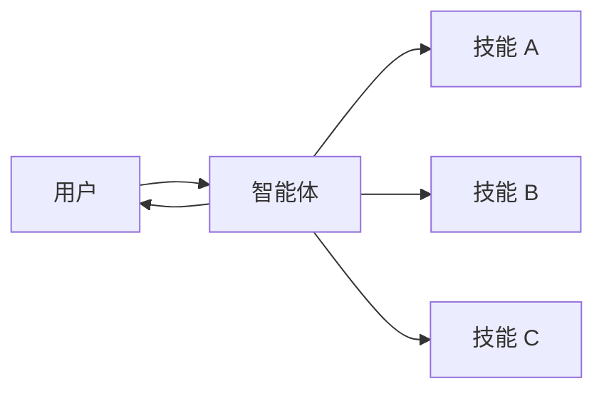

# 技能

在**技能**架构中，专门的功能被封装为可调用的"技能"，增强[智能体](/oss/python/langchain/agents)的行为。技能主要是提示驱动的专门化，智能体可以按需调用。

<Tip>
  此模式在概念上与 [llms.txt](https://llmstxt.org/)（由 Jeremy Howard 引入）相同，后者使用工具调用来渐进式披露文档。技能模式将相同的方法应用于专门提示和领域知识，而不仅仅是文档页面。
</Tip>



## 关键特征

* **提示驱动的专门化**：技能主要由专门提示定义
* **渐进式披露**：技能根据上下文或用户需求变得可用
* **团队分布**：不同团队可以独立开发和维护技能
* **轻量级组合**：技能比完整的子智能体更简单

## 使用场景

当您想要一个具有许多可能专门化的单个[智能体](/oss/python/langchain/agents)，您不需要在技能之间强制执行特定的约束，或不同团队需要独立开发功能时，使用技能模式。常见示例包括编码助手（不同语言或任务的技能）、知识库（不同领域的技能）和创意助手（不同格式的技能）。

## 基本实现

```python
from langchain.tools import tool
from langchain.agents import create_agent

@tool
def load_skill(skill_name: str) -> str:
    """加载专门的技能提示。

    可用技能：
    - write_sql: SQL 查询编写专家
    - review_legal_doc: 法律文件审查员

    返回技能的提示和上下文。
    """
    # 从文件/数据库加载技能内容
    ...

agent = create_agent(
    model="gpt-4o",
    tools=[load_skill],
    system_prompt=(
        "您是一个有用的助手。"
        "您可以访问两种技能："
        "write_sql 和 review_legal_doc。"
        "使用 load_skill 来访问它们。"
    ),
)
```

有关完整实现，请参阅下面的教程。

**教程：使用按需技能构建 SQL 助手**

学习如何实现带有渐进式披露的技能，其中智能体按需加载专门的提示和模式，而不是 upfront。

## 扩展模式

在编写自定义实现时，您可以通过几种方式扩展基本技能模式：

* **动态工具注册**：将渐进式披露与状态管理相结合，以在技能加载时注册新的[工具](/oss/python/langchain/tools)。例如，加载"database_admin"技能可以同时添加专门上下文并注册特定于数据库的工具（备份、恢复、迁移）。这使用跨多智能体模式相同的工具和状态机制——工具更新状态以动态更改智能体功能。

* **层级技能**：技能可以在树结构中定义其他技能，创建嵌套专门化。例如，加载"data_science"技能可能会使"pandas_expert"、"visualization"和"statistical_analysis"等子技能可用。每个子技能可以根据需要独立加载，允许领域知识的细粒度渐进式披露。这种分层方法通过将功能组织成可以按需发现和加载的逻辑分组来帮助管理大型知识库。

