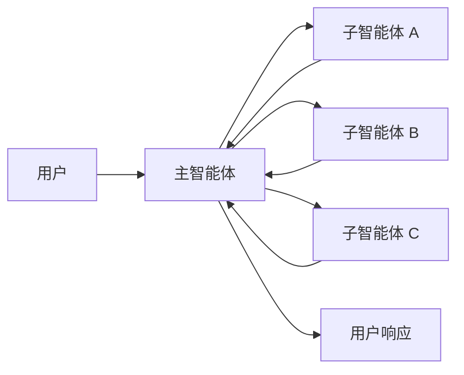
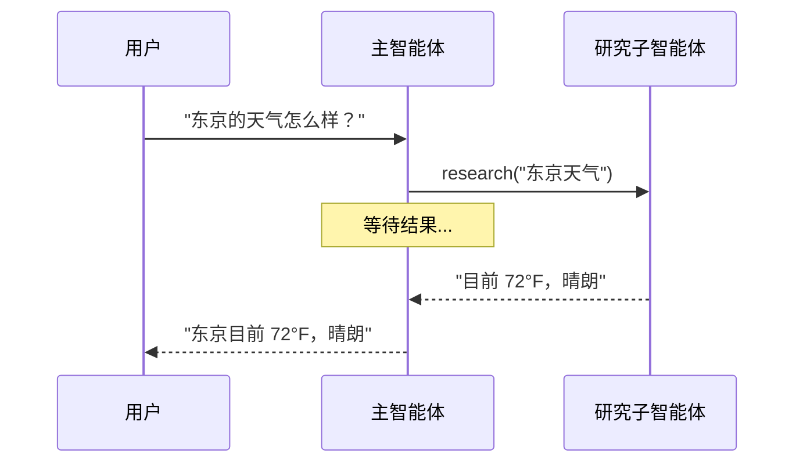
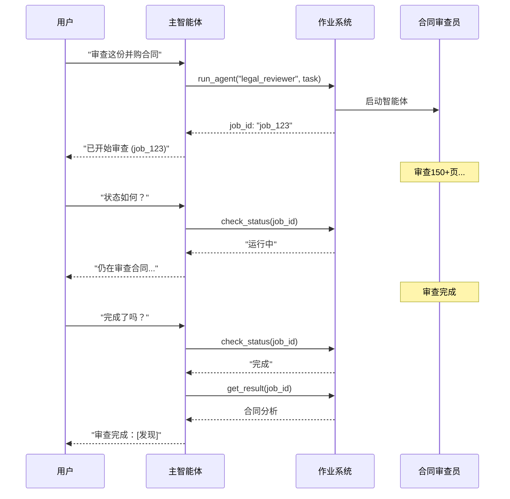
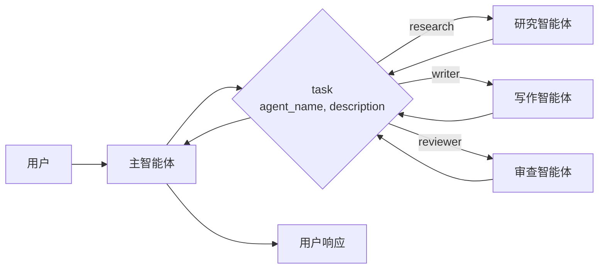

# 子智能体

在**子智能体**架构中，一个中央主[智能体(https://docs.langchain.com/oss/python/langchain/agents)（通常称为**监督者**）通过将子智能体作为[工具(https://docs.langchain.com/oss/python/langchain/tools)调用来协调它们。主智能体决定调用哪个子智能体、提供什么输入以及如何组合结果。子智能体是无状态的——它们不记住过去的交互，所有对话记忆都由主智能体维护。这提供了[上下文(https://docs.langchain.com/oss/python/langchain/context-engineering)隔离：每次子智能体调用都在干净的上下文窗口中工作，防止主对话中的上下文膨胀。



## 关键特征

* **集中控制**：所有路由都通过主智能体
* **无直接用户交互**：子智能体将结果返回给主智能体，而不是用户（尽管您可以在子智能体内使用[中断(https://docs.langchain.com/oss/python/langgraph/human-in-the-loop#interrupt)来允许用户交互）
* **通过工具调用子智能体**：子智能体通过工具被调用
* **并行执行**：主智能体可以在单轮中调用多个子智能体

<Note>
  **监督者 vs. 路由器**：监督者智能体（此模式）与[路由器(https://docs.langchain.com/oss/python/langchain/multi-agent/router)不同。监督者是一个完整的智能体，维护对话上下文并在多轮中动态决定调用哪些子智能体。路由器通常是单个分类步骤，在不维护持续对话状态的情况下将请求分派给智能体。
</Note>

## 使用场景

当您有多个不同的领域（例如日历、电子邮件、CRM、数据库），子智能体不需要直接与用户对话，或者您想要集中式工作流控制时，使用子智能体模式。对于只有少量[工具(https://docs.langchain.com/oss/python/langchain/tools)的更简单情况，请使用[单个智能体(https://docs.langchain.com/oss/python/langchain/agents)。

<Tip>
  **需要在子智能体内进行用户交互？** 虽然子智能体通常将结果返回给主智能体而不是直接与用户对话，但您可以在子智能体内使用[中断(https://docs.langchain.com/oss/python/langgraph/human-in-the-loop#interrupt)来暂停执行并收集用户输入。当子智能体在继续之前需要澄清或批准时，这很有用。主智能体保持编排者角色，但子智能体可以在任务中间从用户那里收集信息。
</Tip>

## 基本实现

核心机制是将子智能体包装为主智能体可以调用的工具：

```python
from langchain.tools import tool
from langchain.agents import create_agent

# 创建子智能体
subagent = create_agent(model="anthropic:claude-sonnet-4-20250514", tools=[...])

# 将其包装为工具
@tool("research", description="研究一个主题并返回发现")
def call_research_agent(query: str):
    result = subagent.invoke({"messages": [{"role": "user", "content": query}]})
    return result["messages"][-1].content

# 主智能体，将子智能体作为工具
main_agent = create_agent(model="anthropic:claude-sonnet-4-20250514", tools=[call_research_agent])
```

**教程：使用子智能体构建个人助手**

学习如何使用子智能体模式构建个人助手，其中中央主智能体（监督者）协调专门的工作智能体。

## 设计决策

实现子智能体模式时，您需要做出几个关键的设计选择。此表总结了选项——每个选项在下面的部分中有详细介绍。

| 决策 | 选项 |
| ---- | ---- |
| [**同步 vs. 异步**](#同步-vs-async) | 同步（阻塞）vs. 异步（后台） |
| [**工具模式**](#工具模式) | 每个智能体一个工具 vs. 单个分发工具 |
| [**子智能体输入**](#子智能体输入) | 仅查询 vs. 完整上下文 |
| [**子智能体输出**](#子智能体输出) | 子智能体结果 vs. 完整对话历史 |

## 同步 vs. 异步

子智能体执行可以是**同步**（阻塞）或**异步**（后台）。您的选择取决于主智能体是否需要结果才能继续。

| 模式 | 主智能体行为 | 适用于 | 权衡 |
| ---- | ----------- | ------ | ---- |
| **同步** | 等待子智能体完成 | 主智能体需要结果才能继续 | 简单，但会阻塞对话 |
| **异步** | 在子智能体在后台运行时继续 | 独立任务，用户不应该等待 | 响应更快，但更复杂 |

<Tip>
  不要与 Python 的 `async`/`await` 混淆。在这里，"异步"意味着主智能体启动一个后台作业（通常在单独的进程或服务中）而不阻塞。
</Tip>

### 同步（默认）

默认情况下，子智能体调用是**同步的**——主智能体在继续之前等待每个子智能体完成。当主智能体的下一个操作依赖于子智能体的结果时，使用同步。



**何时使用同步：**

* 主智能体需要子智能体的结果来制定响应
* 任务有顺序依赖（例如获取数据 → 分析 → 响应）
* 子智能体失败应该阻止主智能体的响应

**权衡：**

* 简单实现——只需调用并等待
* 在所有子智能体完成之前用户看不到响应
* 长任务会冻结对话

### 异步

当子智能体的工作是独立的——主智能体不需要结果来继续与用户对话时，使用**异步执行**。主智能体启动一个后台作业并保持响应。



**何时使用异步：**

* 子智能体工作独立于主对话流程
* 用户应该能够在工作进行时继续聊天
* 您想要并行运行多个独立任务

**三工具模式：**

1. **启动作业**：启动后台任务，返回作业 ID
2. **检查状态**：返回当前状态（待处理、运行中、已完成、失败）
3. **获取结果**：检索完成的结果

**处理作业完成：** 当作业完成时，您的应用程序需要通知用户。一种方法：显示一个通知，点击时发送类似"检查 job_123 并总结结果"的 `HumanMessage`。

## 工具模式

将子智能体作为工具暴露有两种主要方式：

| 模式 | 适用于 | 权衡 |
| ---- | ------ | ---- |
| [**每个智能体一个工具**](#每个智能体一个工具) | 对每个子智能体的输入/输出进行细粒度控制 | 更多设置，但更多自定义 |
| [**单个分发工具**](#单个分发工具) | 许多智能体、分布式团队、约定优于配置 | 更简单的组合，每个智能体更少的自定义 |

### 每个智能体一个工具


核心思想是将子智能体包装为主智能体可以调用的工具：

```python
from langchain.tools import tool
from langchain.agents import create_agent

# 创建子智能体
subagent = create_agent(model="...", tools=[...])

# 将其包装为工具
@tool("subagent_name", description="subagent_description")
def call_subagent(query: str):
    result = subagent.invoke({"messages": [{"role": "user", "content": query}]})
    return result["messages"][-1].content

# 主智能体，将子智能体作为工具
main_agent = create_agent(model="...", tools=[call_subagent])
```

主智能体在决定任务匹配子智能体描述时调用子智能体工具，接收结果，然后继续编排。请参阅[上下文工程](#上下文工程)了解细粒度控制。

### 单个分发工具

另一种方法使用单个参数化工具来调用独立任务的临时子智能体。与[每个智能体一个工具](#每个智能体一个工具)方法（其中每个子智能体被包装为单独的工具）不同，这使用基于约定的方法和单个 `task` 工具：任务描述作为人类消息传递给子智能体，子智能体的最终消息作为工具结果返回。

当您想要跨多个团队分配智能体开发、需要将复杂任务隔离到单独的上下文窗口、需要可扩展的方式来添加新智能体而不修改协调器、或偏好约定优于自定义时，使用此方法。这种方法以智能体组合的简单性和强大的上下文隔离换取上下文工程的灵活性。



**关键特征：**

* **单个任务工具**：一个参数化工具，可以按名称调用任何注册的子智能体
* **基于约定的调用**：按名称选择智能体，任务作为人类消息传递，最终消息作为工具结果返回
* **团队分布**：不同团队可以独立开发和部署智能体
* **智能体发现**：子智能体可以通过系统提示（列出可用的智能体）或通过[渐进式披露(https://docs.langchain.com/oss/python/langchain/multi-agent/skills-sql-assistant)（通过工具按需加载智能体信息）被发现

<Tip>
  这种方法的一个有趣方面是子智能体可能具有与主智能体完全相同的能力。在这种情况下，调用子智能体**实际上是关于上下文隔离**作为主要原因——允许复杂的多步骤任务在隔离的上下文窗口中运行，而不使主智能体的对话历史膨胀。子智能体自主完成其工作并仅返回简洁的摘要，保持主线程专注和高效。
</Tip>

**带任务分发器的智能体注册表：**

```python
from langchain.tools import tool
from langchain.agents import create_agent

# 由不同团队开发的子智能体
research_agent = create_agent(
    model="gpt-4o",
    prompt="你是研究专家..."
)

writer_agent = create_agent(
    model="gpt-4o",
    prompt="你是写作专家..."
)

# 可用子智能体的注册表
SUBAGENTS = {
    "research": research_agent,
    "writer": writer_agent,
}

@tool
def task(
    agent_name: str,
    description: str
) -> str:
    """为任务启动临时子智能体。

    可用智能体：
    - research: 研究和事实查找
    - writer: 内容创作和编辑
    """
    agent = SUBAGENTS[agent_name]
    result = agent.invoke({
        "messages": [
            {"role": "user", "content": description}
        ]
    })
    return result["messages"][-1].content

# 主协调智能体
main_agent = create_agent(
    model="gpt-4o",
    tools=[task],
    system_prompt=(
        "您协调专门的子智能体。"
        "可用：research（事实查找），"
        "writer（内容创作）。"
        "使用任务工具委派工作。"
    ),
)
```

## 上下文工程

控制上下文如何在主智能体及其子智能体之间流动：

| 类别 | 目的 | 影响 |
| ---- | ---- | ---- |
| [**子智能体规范**](#子智能体规范) | 确保在应该调用子智能体时被调用 | 主智能体路由决策 |
| [**子智能体输入**](#子智能体输入) | 确保子智能体能够使用优化的上下文良好执行 | 子智能体性能 |
| [**子智能体输出**](#子智能体输出) | 确保监督者能够对子智能体结果采取行动 | 主智能体性能 |

另请参阅我们关于智能体[上下文工程(https://docs.langchain.com/oss/python/langchain/context-engineering)的综合指南。

### 子智能体规范

与子智能体关联的**名称**和**描述**是主智能体知道要调用哪些子智能体的主要方式。这些是提示杠杆——请仔细选择。

* **名称**：主智能体如何引用子智能体。保持清晰且面向操作（例如 `research_agent`、`code_reviewer`）。
* **描述**：主智能体对子智能体能力的了解。明确说明它处理什么任务以及何时使用它。

对于[单个分发工具](#单个分发工具)设计，主智能体需要使用要调用的子智能体名称调用 `task` 工具。可用工具可以通过以下方法之一提供给主智能体：

* **系统提示枚举**：在系统提示中列出可用的智能体
* **分发工具上的枚举约束**：对于小型智能体列表，向 `agent_name` 字段添加枚举
* **基于工具的发现**：对于大型或动态智能体注册表，提供一个单独的工具（例如 `list_agents` 或 `search_agents`）返回可用的智能体

### 子智能体输入

自定义子智能体接收什么上下文来执行其任务。通过从智能体的状态中拉取，添加在静态提示中不切实际捕获的输入——完整的消息历史、先前的结果或任务元数据。

```python
from langchain.agents import AgentState
from langchain.tools import tool, ToolRuntime

class CustomState(AgentState):
    example_state_key: str

@tool(
    "subagent1_name",
    description="subagent1_description"
)
def call_subagent1(query: str, runtime: ToolRuntime[None, CustomState]):
    # 应用任何需要的逻辑将消息转换为合适的输入
    subagent_input = some_logic(query, runtime.state["messages"])
    result = subagent1.invoke({
        "messages": subagent_input,
        # 您也可以根据需要在这里传递其他状态键。
        # 确保在主智能体和子智能体的状态模式中都定义了这些。
        "example_state_key": runtime.state["example_state_key"]
    })
    return result["messages"][-1].content
```

### 子智能体输出

自定义主智能体接收回什么以便它能够做出好的决策。有两种策略：

1. **提示子智能体**：准确指定应该返回什么。常见的失败模式是子智能体执行工具调用或推理，但不在其最终消息中包含结果——提醒它监督者只看到最终输出。
2. **在代码中格式化**：在返回之前调整或丰富响应。例如，使用 [`Command`(https://docs.langchain.com/oss/python/langgraph/graph-api#command) 将特定状态键与最终文本一起传回。

```python
from typing import Annotated
from langchain.agents import AgentState
from langchain.tools import InjectedToolCallId
from langgraph.types import Command


@tool(
    "subagent1_name",
    description="subagent1_description"
)
def call_subagent1(
    query: str,
    tool_call_id: Annotated[str, InjectedToolCallId],
) -> Command:
    result = subagent1.invoke({
        "messages": [{"role": "user", "content": query}]
    })
    return Command(update={
        # 从子智能体传回附加状态
        "example_state_key": result["example_state_key"],
        "messages": [
            ToolMessage(
                content=result["messages"][-1].content,
                tool_call_id=tool_call_id
            )
        ]
    })
```


