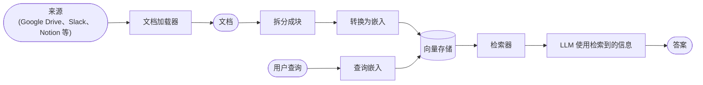
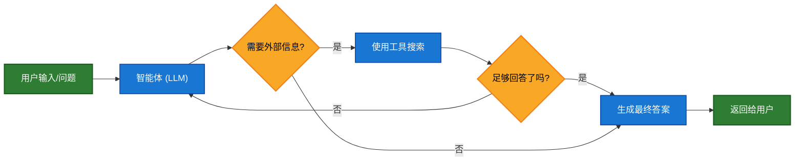
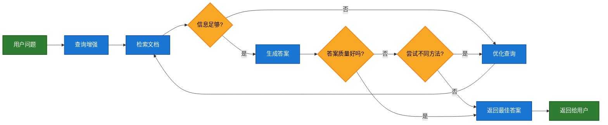

# 检索

大型语言模型（LLM）非常强大，但它们有两个关键限制：

* **有限的上下文** — 它们无法一次性摄取整个语料库。
* **静态知识** — 它们的训练数据在某个时间点就冻结了。

检索通过在查询时获取相关的外部知识来解决这些问题。这是**检索增强生成（RAG）**的基础：用特定于上下文的信息增强 LLM 的回答。

## 构建知识库

**知识库**是检索期间使用的文档或结构化数据存储库。

如果您需要自定义知识库，可以使用 LangChain 的文档加载器和向量存储从您自己的数据构建一个。

如果您已经有一个知识库（例如，SQL 数据库、CRM 或内部文档系统），您**不需要**重建它。您可以：

* 将其作为智能体中的**工具**连接到代理式 RAG。
* 查询它并将检索到的内容作为上下文提供给 LLM（[两步 RAG](#两步-rag)）。

请参阅以下教程来构建可搜索的知识库和最小 RAG 工作流：

**教程：语义搜索**

学习如何使用 LangChain 的文档加载器、嵌入和向量存储从您自己的数据创建可搜索的知识库。

在本教程中，您将构建一个针对 PDF 的搜索引擎，实现检索与查询相关的段落。您还将在此引擎之上实现一个最小 RAG 工作流，以了解如何将外部知识集成到 LLM 推理中。

### 从检索到 RAG

检索允许 LLM 在运行时访问相关上下文。但大多数实际应用更进了一步：**将检索与生成结合**以产生基于事实的、上下文感知的答案。

这是**检索增强生成（RAG）**的核心思想。检索管道成为更广泛系统的基础，该系统将搜索与生成相结合。

### 检索管道

典型的检索工作流程如下所示：



每个组件都是模块化的：您可以交换加载器、拆分器、嵌入模型或向量存储，而无需重写应用程序的逻辑。

### 构建模块

**文档加载器**

从外部源（Google Drive、Slack、Notion 等）摄取数据，返回标准化的 [`Document`](https://reference.langchain.com/python/langchain_core/documents/#langchain_core.documents.base.Document) 对象。

**文本拆分器**

将大型文档拆分成更小的块，这些块可以单独检索并适合模型的上下文窗口。

**嵌入模型**

嵌入模型将文本转换为数字向量，以便具有相似含义的文本在该向量空间中位于相近位置。

**向量存储**

用于存储和搜索嵌入的专业数据库。

**检索器**

检索器是一个接口，给定非结构化查询时返回文档。

## RAG 架构

RAG 可以根据您系统的需求以多种方式实现。我们在下面的部分中概述每种类型。

| 架构 | 描述 | 控制性 | 灵活性 | 延迟 | 示例用例 |
| ---- | ---- | ------ | ------ | ---- | -------- |
| **两步 RAG** | 检索总是在生成之前发生。简单且可预测 | 高 | 低 | 快 | 常见问题解答、文档机器人 |
| **代理式 RAG** | 由 LLM 驱动的智能体决定在推理过程中*何时*以及*如何*检索 | 低 | 高 | 可变 | 具有多个工具访问权限的研究助手 |
| **混合** | 结合两种方法的特点并带有验证步骤 | 中 | 中 | 可变 | 带有质量验证的特定领域问答 |

**延迟**：延迟在**两步 RAG** 中通常更**可预测**，因为最大 LLM 调用次数是已知且有上限的。这种可预测性假设 LLM 推理时间是主要因素。然而，现实世界的延迟也可能受到检索步骤性能的影响——如 API 响应时间、网络延迟或数据库查询——这些可能因使用的工具和基础设施而异。

### 两步 RAG

在**两步 RAG**中，检索步骤总是在生成步骤之前执行。这种架构简单且可预测，适用于许多应用，其中检索相关文档是生成答案的明确先决条件。


**教程：检索增强生成（RAG）**

了解如何构建一个基于数据的问答聊天机器人，使用检索增强生成来回答问题。

本教程介绍了两种方法：

* **RAG 智能体**——使用灵活的工具运行搜索，适用于通用用途。
* **两步 RAG** 链——每个查询只需要一次 LLM 调用——对于更简单的任务快速高效。

### 代理式 RAG

**代理式检索增强生成（RAG）**将检索增强生成的优势与基于智能体的推理相结合。智能体（由 LLM 驱动）会逐步推理，并决定在交互过程中**何时**以及**如何**检索信息，而不是在回答之前检索文档。

<Tip>
  智能体只需要访问一个或多个可以获取外部知识的**工具**——如文档加载器、网页 API 或数据库查询——就可以启用 RAG 行为。
</Tip>



```python
import requests
from langchain.tools import tool
from langchain.chat_models import init_chat_model
from langchain.agents import create_agent


@tool
def fetch_url(url: str) -> str:
    """从 URL 获取文本内容"""
    response = requests.get(url, timeout=10.0)
    response.raise_for_status()
    return response.text

system_prompt = """\
当需要从网页获取信息时使用 fetch_url；引用相关片段。
"""

agent = create_agent(
    model="claude-sonnet-4-5-20250929",
    tools=[fetch_url], # 用于检索的工具
    system_prompt=system_prompt,
)
```

**扩展示例：用于 LangGraph llms.txt 的代理式 RAG**

此示例实现了一个**代理式 RAG 系统**，以帮助用户查询 LangGraph 文档。智能体首先加载 [llms.txt](https://llmstxt.org/)，其中列出了可用的文档 URL，然后可以根据用户的问题动态使用 `fetch_documentation` 工具来检索和处理相关内容。

```python
import requests
from langchain.agents import create_agent
from langchain.messages import HumanMessage
from langchain.tools import tool
from markdownify import markdownify


ALLOWED_DOMAINS = ["https://langchain-ai.github.io/"]
LLMS_TXT = 'https://langchain-ai.github.io/langgraph/llms.txt'


@tool
def fetch_documentation(url: str) -> str:
    """从 URL 获取并转换文档"""
    if not any(url.startswith(domain) for domain in ALLOWED_DOMAINS):
        return (
            "Error: URL not allowed. "
            f"Must start with one of: {', '.join(ALLOWED_DOMAINS)}"
        )
    response = requests.get(url, timeout=10.0)
    response.raise_for_status()
    return markdownify(response.text)


# 我们将获取 llms.txt 的内容，因此可以
# 提前完成此操作，而无需 LLM 请求。
llms_txt_content = requests.get(LLMS_TXT).text

# 智能体的系统提示
system_prompt = f"""
您是 Python 专家和技术助手。
您的主要角色是帮助用户解决关于 LangGraph 和相关工具的问题。

说明：

1. 如果用户问您不确定的问题——或可能涉及 API 使用、
   行为或配置的问题——您必须使用 `fetch_documentation` 工具查阅相关文档。
2. 引用文档时，请清晰总结并包含内容中的相关上下文。
3. 不要使用允许域之外的任何 URL。
4. 如果文档获取失败，请告诉用户并以您最好的专家理解继续。

您可以从以下批准来源访问官方文档：

{llms_txt_content}

在回答用户关于 LangGraph 的问题之前，您必须查阅文档以获取最新文档。

您的回答应该清晰、简洁且技术准确。
"""

tools = [fetch_documentation]

model = init_chat_model("claude-sonnet-4-0", max_tokens=32_000)

agent = create_agent(
    model=model,
    tools=tools,
    system_prompt=system_prompt,
    name="Agentic RAG",
)

response = agent.invoke({
    'messages': [
        HumanMessage(content=(
            "写一个使用预置创建反应智能体的简短 langgraph 智能体示例。"
            "该智能体应该能够查看股票价格信息。"
        ))
    ]
})

print(response['messages'][-1].content)
```

**教程：检索增强生成（RAG）**

了解如何构建一个基于数据的问答聊天机器人，使用检索增强生成来回答问题。

本教程介绍了两种方法：

* **RAG 智能体**——使用灵活的工具运行搜索，适用于通用用途。
* **两步 RAG** 链——每个查询只需要一次 LLM 调用——对于更简单的任务快速高效。

### 混合 RAG

混合 RAG 结合了两步 RAG 和代理式 RAG 的特点。它引入了中间步骤，如查询预处理、检索验证和生成后检查。这些系统比固定管道提供更多灵活性，同时保持对执行的一些控制。

典型组件包括：

* **查询增强**：修改输入问题以提高检索质量。这可能涉及重写不清晰的查询、生成多个变体或用额外上下文扩展查询。
* **检索验证**：评估检索到的文档是否相关且足够。如果不相关，系统可能优化查询并重新检索。
* **答案验证**：检查生成的答案是否准确、完整并与源内容一致。如果需要，系统可以重新生成或修改答案。

该架构通常支持这些步骤之间的多次迭代：



此架构适用于：

* 模糊或未指定查询的应用程序
* 需要验证或质量控制步骤的系统
* 涉及多个来源或迭代优化的工作流

**教程：带有自我纠正的代理式 RAG**

**混合 RAG** 的示例，结合了代理式推理与检索和自我纠正。


