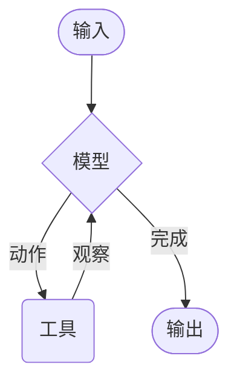

# Agents（智能体）

Agents（智能体）将语言模型与[工具（tools）](./tools.md)结合，创建能够推理任务、决定使用哪些工具并迭代解决问题的系统。

[`create_agent`](https://reference.langchain.com/python/langchain/agents/#langchain.agents.create_agent) 提供了一个可用于生产环境的智能体实现。

[LLM Agent 循环运行工具以实现目标](https://simonwillison.net/2025/Sep/18/agents/)。
智能体会一直运行直到满足停止条件——即模型发出最终输出或达到迭代限制。



`create_agent` 使用 [LangGraph](../advanced-usage/runtime.md) 构建一个基于图（graph）的智能体运行时。图由节点（步骤）和边（连接）组成，定义了智能体如何处理信息。智能体通过这个图移动，执行节点（如调用模型的模型节点、执行工具的工具节点或中间件）。

了解更多关于[图 API](../advanced-usage/runtime.md)。

## 核心组件

### 模型

[模型（model）](./models.md)是智能体的推理引擎。可以通过多种方式指定，支持静态和动态模型选择。

#### 静态模型

静态模型在创建智能体时配置一次，在整个执行过程中保持不变。这是最常见和直接的方法。

要从模型标识符字符串初始化静态模型（遵循 `provider:model` 格式的字符串，例如 openai:gpt-5）：

```python
from langchain.agents import create_agent

agent = create_agent("openai:gpt-5", tools=tools)
```

模型标识符字符串支持自动推断（例如，`"gpt-5"` 将被推断为 `"openai:gpt-5"`）。请参阅[参考文档](https://reference.langchain.com/python/langchain/models/#langchain.chat_models.init_chat_model)查看完整的模型标识符字符串映射列表。

要更精细地控制模型配置，可以使用 provider 包直接初始化模型实例。在这个例子中，我们使用 `ChatOpenAI`。查看[对话模型](./models.md)了解其他可用的对话模型类。

```python
from langchain.agents import create_agent
from langchain_openai import ChatOpenAI

model = ChatOpenAI(
    model="gpt-5",
    temperature=0.1,
    max_tokens=1000,
    timeout=30
)
agent = create_agent(model, tools=tools)
```

模型实例让你完全控制配置。需要设置特定参数如 `temperature`、`max_tokens`、`timeouts`、`base_url` 和其他 provider 特定设置时使用它们。

#### 动态模型

动态模型根据当前的状态（state）和上下文在运行时（runtime）选择。这支持复杂的路由逻辑和成本优化。

要使用动态模型，使用 `@wrap_model_call` 装饰器创建中间件来修改请求中的模型：

```python
from langchain_openai import ChatOpenAI
from langchain.agents import create_agent
from langchain.agents.middleware import wrap_model_call, ModelRequest, ModelResponse

basic_model = ChatOpenAI(model="gpt-4o-mini")
advanced_model = ChatOpenAI(model="gpt-4o")

@wrap_model_call
def dynamic_model_selection(request: ModelRequest, handler) -> ModelResponse:
    """根据对话复杂性选择模型。"""
    message_count = len(request.state["messages"])

    if message_count > 10:
        model = advanced_model
    else:
        model = basic_model

    return handler(request.override(model=model))

agent = create_agent(
    model=basic_model,
    tools=tools,
    middleware=[dynamic_model_selection]
)
```

预绑定模型（已经调用了 `bind_tools` 的模型）在使用结构化输出时不受支持。如果需要带结构化输出的动态模型选择，请确保传递给中间件的模型不是预绑定的。

有关模型配置详情，请参阅[模型](./models.md)。有关动态模型选择模式，请参阅[中间件中的动态模型](../middleware/overview.md)。

### 工具

工具赋予智能体行动的能力。智能体不仅限于简单的模型工具绑定，还支持：

- 序列中的多次工具调用（由单个提示触发）
- 适当的并行工具调用
- 基于之前结果的动态工具选择
- 工具重试逻辑和错误处理
- 跨工具调用的状态持久化

更多信息，请参阅[工具](./tools.md)。

#### 定义工具

传递一个工具列表给智能体。

工具可以指定为普通的 Python 函数或协程（可以暂停执行并在稍后恢复的方法）。工具装饰器可用于自定义工具名称、描述、参数模式和其他属性。

```python
from langchain.tools import tool
from langchain.agents import create_agent

@tool
def search(query: str) -> str:
    """搜索信息。"""
    return f"搜索结果: {query}"

@tool
def get_weather(location: str) -> str:
    """获取地点的天气信息。"""
    return f"{location}的天气: 晴朗, 22°C"

agent = create_agent(model, tools=[search, get_weather])
```

如果提供了空工具列表，智能体将只包含一个没有工具调用能力的 LLM 节点。

#### 工具错误处理

要自定义工具错误处理方式，使用 `@wrap_tool_call` 装饰器创建中间件：

```python
from langchain.agents import create_agent
from langchain.agents.middleware import wrap_tool_call
from langchain.messages import ToolMessage

@wrap_tool_call
def handle_tool_errors(request, handler):
    """使用自定义消息处理工具执行错误。"""
    try:
        return handler(request)
    except Exception as e:
        return ToolMessage(
            content=f"工具错误：请检查输入并重试。({str(e)})",
            tool_call_id=request.tool_call["id"]
        )

agent = create_agent(
    model="gpt-4o",
    tools=[search, get_weather],
    middleware=[handle_tool_errors]
)
```

当工具失败时，智能体将返回带有自定义错误消息的 `ToolMessage`：

```python
[
    ToolMessage(
        content="工具错误：请检查输入并重试。（除以零）",
        tool_call_id="..."
    ),
]
```

#### ReAct 循环中的工具使用

智能体遵循 ReAct（Reasoning + Acting）模式，在简短推理步骤与有针对性的工具调用之间交替，并将观察结果反馈到后续决策中，直到能够给出最终答案。

**ReAct 循环示例：**

用户提问：找到目前最流行的无线耳机并检查是否有库存

1. 推理：流行度是随时间变化的，我需要使用提供的搜索工具。
2. 行动：调用 `search_products("wireless headphones")`
3. 工具返回：找到 5 个匹配产品，前 5 名：WH-1000XM5 等
4. 推理：在回答之前，我需要确认排名靠前产品的库存状态。
5. 行动：调用 `check_inventory("WH-1000XM5")`
6. 工具返回：产品 WH-1000XM5 库存 10 件
7. 推理：我有了最流行的型号及其库存状态，现在可以回答用户的问题了。
8. 行动：生成最终答案

要了解有关工具的更多信息，请参阅[工具](./tools.md)。

### 系统提示词

你可以通过提供提示词来塑造智能体处理任务的方式。`system_prompt` 参数可以作为字符串提供：

```python
agent = create_agent(
    model,
    tools,
    system_prompt="你是一个有帮助的助手。请简洁准确。"
)
```

如果没有提供 `system_prompt`，智能体将直接从消息中推断任务。

`system_prompt` 参数接受 `str` 或 `SystemMessage`。使用 `SystemMessage` 可以更好地控制提示词结构，这对于特定于 provider 的功能（如 Anthropic 的提示词缓存）很有用：

```python
from langchain.agents import create_agent
from langchain.messages import SystemMessage, HumanMessage

literary_agent = create_agent(
    model="anthropic:claude-sonnet-4-5",
    system_prompt=SystemMessage(
        content=[
            {
                "type": "text",
                "text": "你是一个负责分析文学作品的 AI 助手。",
            },
            {
                "type": "text",
                "text": "<《傲慢与偏见》的全部内容>",
                "cache_control": {"type": "ephemeral"}
            }
        ]
    )
)

result = literary_agent.invoke(
    {"messages": [HumanMessage("分析《傲慢与偏见》的主要主题。")]}
)
```

带有 `{"type": "ephemeral"}` 的 `cache_control` 字段告诉 Anthropic 缓存该内容块，减少使用相同系统提示词的重复请求的延迟和成本。

#### 动态系统提示词

对于更高级的用例，需要根据运行时上下文或智能体状态修改系统提示词，可以使用中间件。

`@dynamic_prompt` 装饰器创建基于模型请求生成系统提示词的中间件：

```python
from typing import TypedDict

from langchain.agents import create_agent
from langchain.agents.middleware import dynamic_prompt, ModelRequest

class Context(TypedDict):
    user_role: str

@dynamic_prompt
def user_role_prompt(request: ModelRequest) -> str:
    """根据用户角色生成系统提示词。"""
    user_role = request.runtime.context.get("user_role", "user")
    base_prompt = "你是一个有帮助的助手。"

    if user_role == "expert":
        return f"{base_prompt} 提供详细的技术性回复。"
    elif user_role == "beginner":
        return f"{base_prompt} 简单解释概念，避免行话。"

    return base_prompt

agent = create_agent(
    model="gpt-4o",
    tools=[web_search],
    middleware=[user_role_prompt],
    context_schema=Context
)

result = agent.invoke(
    {"messages": [{"role": "user", "content": "解释机器学习"}]},
    context={"user_role": "expert"}
)
```

有关消息类型和格式的更多详情，请参阅[消息](./messages.md)。有关完整的中间件文档，请参阅[中间件](../middleware/overview.md)。

## 调用

你可以通过向智能体的状态（State）传递更新来调用智能体。所有智能体都在其状态中包含一系列消息（message）；要调用智能体，传递一条新消息：

```python
result = agent.invoke(
    {"messages": [{"role": "user", "content": "旧金山的天气怎么样？"}]}
)
```

要从智能体流式传输步骤和/或令牌，请参阅[流式输出](./streaming/overview.md)指南。

否则，智能体遵循 LangGraph 图 API，并支持所有相关方法，如 `stream` 和 `invoke`。

## 高级概念

### 结构化输出

在某些情况下，你可能希望智能体以特定格式返回输出。LangChain 通过 `response_format` 参数提供结构化输出策略。

#### ToolStrategy

`ToolStrategy` 使用人工工具调用来生成结构化输出。这适用于任何支持工具调用的模型。当 provider 原生结构化输出（通过 `ProviderStrategy`）不可用或不可靠时，应使用 `ToolStrategy`。

```python
from pydantic import BaseModel
from langchain.agents import create_agent
from langchain.agents.structured_output import ToolStrategy

class ContactInfo(BaseModel):
    name: str
    email: str
    phone: str

agent = create_agent(
    model="gpt-4o-mini",
    tools=[search_tool],
    response_format=ToolStrategy(ContactInfo)
)

result = agent.invoke({
    "messages": [{"role": "user", "content": "从以下信息中提取联系信息：张三，zhangsan@example.com，(555) 123-4567"}]
})

result["structured_response"]
```

#### ProviderStrategy

`ProviderStrategy` 使用模型 provider 的原生结构化输出生成。这更可靠，但仅适用于支持原生结构化输出的 provider：

```python
from langchain.agents.structured_output import ProviderStrategy

agent = create_agent(
    model="gpt-4o",
    response_format=ProviderStrategy(ContactInfo)
)
```

从 `langchain 1.0` 开始，简单传递模式（例如 `response_format=ContactInfo`）不再受支持。你必须明确使用 `ToolStrategy` 或 `ProviderStrategy`。

要了解结构化输出，请参阅[结构化输出](./structured-output.md)。

### 记忆

智能体通过消息状态自动维护对话历史记录。你还可以配置智能体使用自定义状态模式来记住对话中的其他信息。

存储在状态中的信息可以看作是智能体的[短期记忆](./short-term-memory.md)。

自定义状态模式必须扩展 `AgentState` 作为 `TypedDict`。

有两种方式定义自定义状态：

1. 通过中间件（推荐）
2. 通过 `create_agent` 上的 `state_schema`

#### 通过中间件定义状态

当自定义状态需要被特定中间件钩子和工具访问时，使用中间件定义自定义状态。

```python
from langchain.agents import AgentState
from langchain.agents.middleware import AgentMiddleware
from typing import Any

class CustomState(AgentState):
    user_preferences: dict

class CustomMiddleware(AgentMiddleware):
    state_schema = CustomState
    tools = [tool1, tool2]

    def before_model(self, state: CustomState, runtime) -> dict[str, Any] | None:
        ...

agent = create_agent(
    model,
    tools=tools,
    middleware=[CustomMiddleware()]
)

result = agent.invoke({
    "messages": [{"role": "user", "content": "我更喜欢技术性解释"}],
    "user_preferences": {"style": "technical", "verbosity": "detailed"},
})
```

#### 通过 `state_schema` 定义状态

使用 `state_schema` 参数作为快捷方式来定义仅在工具中使用的自定义状态。

```python
from langchain.agents import AgentState

class CustomState(AgentState):
    user_preferences: dict

agent = create_agent(
    model,
    tools=[tool1, tool2],
    state_schema=CustomState
)

result = agent.invoke({
    "messages": [{"role": "user", "content": "我更喜欢技术性解释"}],
    "user_preferences": {"style": "technical", "verbosity": "detailed"},
})
```

从 `langchain 1.0` 开始，自定义状态模式必须是 `TypedDict` 类型。Pydantic 模型和数据类不再受支持。

通过中间件定义自定义状态优于通过 `create_agent` 上的 `state_schema` 定义，因为它允许你将状态扩展保持在相关中间件和工具的概念范围内。`state_schema` 在 `create_agent` 上仍支持向后兼容。

要了解有关记忆的更多信息，请参阅[记忆](./short-term-memory.md)。有关实现跨会话持久化的长期记忆的信息，请参阅[长期记忆](../advanced-usage/long-term-memory.md)。

### 流式输出

我们已经看到如何用 `invoke` 调用智能体来获取最终响应。如果智能体执行多个步骤，这可能需要一段时间。为了显示中间进度，我们可以在消息发生时流式传输它们。

```python
for chunk in agent.stream({
    "messages": [{"role": "user", "content": "搜索 AI 新闻并总结发现"}]
}, stream_mode="values"):
    latest_message = chunk["messages"][-1]
    if latest_message.content:
        print(f"智能体: {latest_message.content}")
    elif latest_message.tool_calls:
        print(f"调用工具: {[tc['name'] for tc in latest_message.tool_calls]}")
```

有关流式输出的更多详情，请参阅[流式输出](./streaming/overview.md)。

### 中间件

中间件（Middleware）为在执行的不同阶段自定义智能体行为提供了强大的扩展性。你可以使用中间件来：

- 在调用模型之前处理状态（例如，消息修剪、上下文注入）
- 修改或验证模型的响应（例如，护栏、内容过滤）
- 使用自定义逻辑处理工具执行错误
- 基于状态或上下文实现动态模型选择
- 添加自定义日志记录、监控或分析

中间件无缝集成到智能体的执行中，允许你拦截和修改关键点的数据流，而无需更改核心智能体逻辑。

有关完整的中间件文档，包括 `@before_model`、`@after_model` 和 `@wrap_tool_call` 等装饰器，请参阅[中间件](../middleware/overview.md)。


