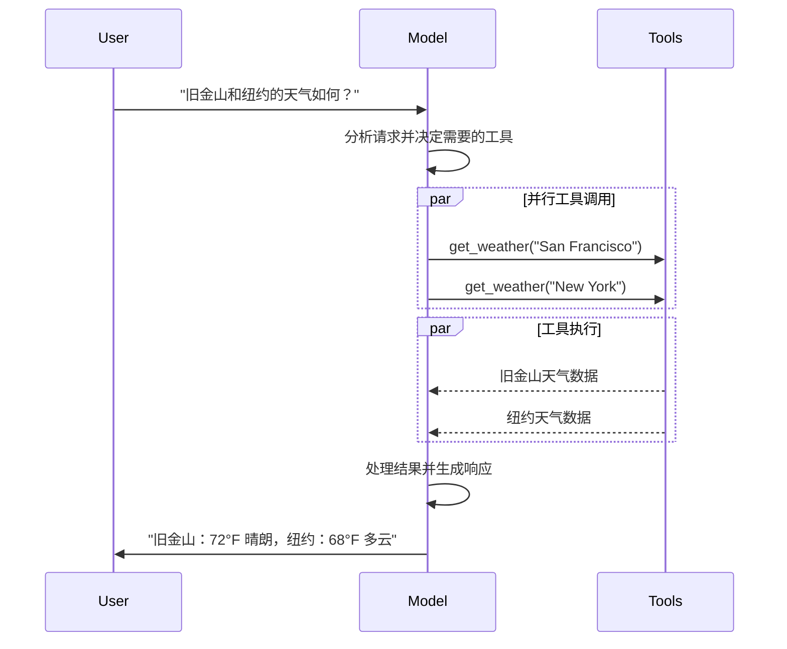

# Models（模型）

[LLMs（大型语言模型）](https://en.wikipedia.org/wiki/Large_language_model) 是强大的 AI 工具，可以像人类一样解释和生成文本。它们用途广泛，可以编写内容、翻译语言、总结和回答问题，无需针对每项任务进行专门训练。

除了文本生成外，许多模型还支持：

- [工具调用](#tool-calling) - 调用外部工具（如数据库查询或 API 调用）并在响应中使用结果
- [结构化输出](#structured-output) - 模型的响应被限制为遵循定义的格式
- [多模态](#multimodal) - 处理和返回除文本以外的数据，如图像、音频和视频
- [推理](#reasoning) - 模型执行多步骤推理以得出结论

模型是[代理（agents）](./agents.md)的推理引擎。它们驱动代理的决策过程，确定调用哪些工具、如何解释结果以及何时提供最终答案。

你选择的模型的质量和能力直接影响代理的基线可靠性和性能。不同的模型擅长不同的任务——有些更擅长遵循复杂指令，有些更擅长结构化推理，有些支持更大的上下文窗口来处理更多信息。

LangChain 的标准模型接口让你可以访问许多不同的 provider 集成，这使得你可以轻松试验和切换模型，找到最适合你用例的模型。

有关特定于 provider 的集成信息和功能，请参阅 provider 的[对话模型页面(https://docs.langchain.com/oss/python/integrations/chat)。

## 基本用法

模型可以通过两种方式使用：

1. **与代理一起使用** - 在创建[代理](./agents.md#模型)时可以动态指定模型
2. **独立使用** - 模型可以直接调用（在代理循环之外），用于文本生成、分类或提取等任务，无需代理框架

相同的模型接口在两种情况下都能工作，这为你提供了灵活性，可以从简单开始，根据需要扩展到更复杂的基于代理的工作流程。

### 初始化模型

在 LangChain 中开始使用独立模型的最简单方法是使用 `init_chat_model` 从你选择的对话模型 provider 初始化一个模型（以下是示例）：

**OpenAI**

请阅读 [OpenAI 对话模型集成文档(https://docs.langchain.com/oss/python/integrations/chat/openai)。

```bash
pip install -U "langchain[openai]"
```

```python
import os
from langchain.chat_models import init_chat_model

os.environ["OPENAI_API_KEY"] = "sk-..."

model = init_chat_model("gpt-4.1")
```

或使用模型类：

```python
import os
from langchain_openai import ChatOpenAI

os.environ["OPENAI_API_KEY"] = "sk-..."

model = ChatOpenAI(model="gpt-4.1")
```

**Anthropic**

请阅读 [Anthropic 对话模型集成文档(https://docs.langchain.com/oss/python/integrations/chat/anthropic)。

```bash
pip install -U "langchain[anthropic]"
```

```python
import os
from langchain.chat_models import init_chat_model

os.environ["ANTHROPIC_API_KEY"] = "sk-..."

model = init_chat_model("claude-sonnet-4-5-20250929")
```

或使用模型类：

```python
import os
from langchain_anthropic import ChatAnthropic

os.environ["ANTHROPIC_API_KEY"] = "sk-..."

model = ChatAnthropic(model="claude-sonnet-4-5-20250929")
```

**Azure**

请阅读 [Azure 对话模型集成文档(https://docs.langchain.com/oss/python/integrations/chat/azure_chat_openai)。

```bash
pip install -U "langchain[openai]"
```

```python
import os
from langchain.chat_models import init_chat_model

os.environ["AZURE_OPENAI_API_KEY"] = "..."
os.environ["AZURE_OPENAI_ENDPOINT"] = "..."
os.environ["OPENAI_API_VERSION"] = "2025-03-01-preview"

model = init_chat_model(
    "azure_openai:gpt-4.1",
    azure_deployment=os.environ["AZURE_OPENAI_DEPLOYMENT_NAME"],
)
```

或使用模型类：

```python
import os
from langchain_openai import AzureChatOpenAI

os.environ["AZURE_OPENAI_API_KEY"] = "..."
os.environ["AZURE_OPENAI_ENDPOINT"] = "..."
os.environ["OPENAI_API_VERSION"] = "2025-03-01-preview"

model = AzureChatOpenAI(
    model="gpt-4.1",
    azure_deployment=os.environ["AZURE_OPENAI_DEPLOYMENT_NAME"]
)
```

**Google Gemini**

请阅读 [Google GenAI 对话模型集成文档(https://docs.langchain.com/oss/python/integrations/chat/google_generative_ai)。

```bash
pip install -U "langchain[google-genai]"
```

```python
import os
from langchain.chat_models import init_chat_model

os.environ["GOOGLE_API_KEY"] = "..."

model = init_chat_model("google_genai:gemini-2.5-flash-lite")
```

或使用模型类：

```python
import os
from langchain_google_genai import ChatGoogleGenerativeAI

os.environ["GOOGLE_API_KEY"] = "..."

model = ChatGoogleGenerativeAI(model="gemini-2.5-flash-lite")
```

**AWS Bedrock**

请阅读 [AWS Bedrock 对话模型集成文档(https://docs.langchain.com/oss/python/integrations/chat/bedrock)。

```bash
pip install -U "langchain[aws]"
```

```python
from langchain.chat_models import init_chat_model

# 按照以下步骤配置凭据：
# https://docs.aws.amazon.com/bedrock/latest/userguide/getting-started.html

model = init_chat_model(
    "anthropic.claude-3-5-sonnet-20240620-v1:0",
    model_provider="bedrock_converse",
)
```

或使用模型类：

```python
from langchain_aws import ChatBedrock

model = ChatBedrock(model="anthropic.claude-3-5-sonnet-20240620-v1:0")
```

**HuggingFace**

请阅读 [HuggingFace 对话模型集成文档(https://docs.langchain.com/oss/python/integrations/chat/huggingface)。

```bash
pip install -U "langchain[huggingface]"
```

```python
import os
from langchain.chat_models import init_chat_model

os.environ["HUGGINGFACEHUB_API_TOKEN"] = "hf_..."

model = init_chat_model(
    "microsoft/Phi-3-mini-4k-instruct",
    model_provider="huggingface",
    temperature=0.7,
    max_tokens=1024,
)
```

或使用模型类：

```python
import os
from langchain_huggingface import ChatHuggingFace, HuggingFaceEndpoint

os.environ["HUGGINGFACEHUB_API_TOKEN"] = "hf_..."

llm = HuggingFaceEndpoint(
    repo_id="microsoft/Phi-3-mini-4k-instruct",
    temperature=0.7,
    max_length=1024,
)
model = ChatHuggingFace(llm=llm)
```

```python
response = model.invoke("为什么鹦鹉会说话？")
```

有关更多详细信息，包括如何传递模型[参数](#参数)，请参阅 `init_chat_model`。

### 支持的模型

LangChain 支持所有主要的模型 provider，包括 OpenAI、Anthropic、Google、Azure、AWS Bedrock 等。每个 provider 提供各种具有不同能力的模型。LangChain 中支持模型的完整列表，请参阅[集成页面(https://docs.langchain.com/oss/python/integrations/providers/overview)。

### 核心方法

- **Invoke** - 模型接受消息作为输入，并在生成完整响应后输出消息
- **Stream** - 调用模型，但实时流式输出生成的内容
- **Batch** - 批量向模型发送多个请求以提高处理效率

除了对话模型外，LangChain 还支持其他相邻技术，如嵌入模型和向量存储。详情请参阅[集成页面(https://docs.langchain.com/oss/python/integrations/providers/overview)。

## 参数

对话模型接受可用于配置其行为的参数。支持的完整参数集因模型和 provider 而异，但标准参数包括：

**model**（必需）
- 模型名称或标识符。你也可以使用 `{model_provider}:{model}` 格式在单个参数中同时指定模型及其 provider，例如 `openai:o1`。

**api_key**
- 与模型 provider 进行身份验证所需的密钥。通常在注册访问模型时发放。通常通过设置环境变量来访问。

**temperature**
- 控制模型输出的随机性。较高的数值使响应更具创意；较低的数值使输出更确定性。

**max_tokens**
- 限制响应中的 token 总数，有效控制输出长度。

**timeout**
- 等待模型响应的最大时间（秒），超时后取消请求。

**max_retries**
- 如果请求因网络超时或速率限制等问题失败，系统重试请求的最大次数。

使用 `init_chat_model`，将这些参数作为内联 `**kwargs` 传递：

```python
model = init_chat_model(
    "claude-sonnet-4-5-20250929",
    temperature=0.7,
    timeout=30,
    max_tokens=1000,
)
```

每个对话模型集成可能有用于控制 provider 特定功能的附加参数。

例如，`ChatOpenAI` 有 `use_responses_api` 来决定使用 OpenAI Responses 还是 Completions API。

要查找给定对话模型支持的所有参数，请前往[对话模型集成(https://docs.langchain.com/oss/python/integrations/chat)页面。

---

## 调用

必须调用对话模型才能生成输出。有三种主要的调用方法，每种都适用于不同的用例。

### Invoke

调用模型的最直接方式是使用 `invoke()` 和单条消息或消息列表。

```python
response = model.invoke("为什么鹦鹉有彩色羽毛？")
print(response)
```

可以向对话模型提供消息列表来表示对话历史。每条消息都有一个角色，模型用该角色来表示谁在对话中发送了消息。

有关角色、类型和内容的更多详情，请参阅[messages](./messages.md)指南。

```python
conversation = [
    {"role": "system", "content": "你是一个有帮助的助手，将英语翻译成法语。"},
    {"role": "user", "content": "翻译：我喜欢编程。"},
    {"role": "assistant", "content": "J'adore la programmation."},
    {"role": "user", "content": "翻译：我喜欢构建应用程序。"}
]

response = model.invoke(conversation)
print(response)
```

```python
from langchain.messages import HumanMessage, AIMessage, SystemMessage

conversation = [
    SystemMessage("你是一个有帮助的助手，将英语翻译成法语。"),
    HumanMessage("翻译：我喜欢编程。"),
    AIMessage("J'adore la programmation."),
    HumanMessage("翻译：我喜欢构建应用程序。")
]

response = model.invoke(conversation)
print(response)
```

如果调用的返回类型是字符串，请确保你使用的是对话模型而不是 LLM。传统的文本补全 LLM 直接返回字符串。LangChain 对话模型以 "Chat" 开头，例如 `ChatOpenAI`。

### Stream

大多数模型可以在生成输出时流式输出其内容。通过逐步显示输出，流式传输显著改善了用户体验，特别是对于较长的响应。

调用 `stream()` 返回一个迭代器，逐个产生输出的块。你可以使用循环实时处理每个块：

```python
for chunk in model.stream("为什么鹦鹉有彩色羽毛？"):
    print(chunk.text, end="|", flush=True)
```

```python
for chunk in model.stream("天空是什么颜色？"):
    for block in chunk.content_blocks:
        if block["type"] == "reasoning" and (reasoning := block.get("reasoning")):
            print(f"推理: {reasoning}")
        elif block["type"] == "tool_call_chunk":
            print(f"工具调用块: {block}")
        elif block["type"] == "text":
            print(block["text"])
```

与 `invoke()` 在模型完成生成完整响应后返回单个 `AIMessage` 不同，`stream()` 返回多个 `AIMessageChunk` 对象，每个对象包含输出文本的一部分。重要的是，流中的每个块设计为可以通过累加合成完整消息：

```python
full = None
for chunk in model.stream("天空是什么颜色？"):
    full = chunk if full is None else full + chunk
    print(full.text)

print(full.content_blocks)
```

生成的消息可以与使用 `invoke()` 生成的消息相同的方式处理——例如，可以将其聚合到消息历史中并作为对话上下文传递回模型。

流式传输仅在程序中的所有步骤都知道如何处理块流时才有效。例如，不具备流式传输能力的应用程序需要在处理之前将整个输出存储在内存中。

#### 高级流式传输主题

**流式事件**

对话模型还可以使用 `astream_events()` 流式传输语义事件。

这简化了基于事件类型和其他元数据的筛选，并会在后台聚合完整消息。

```python
async for event in model.astream_events("你好"):
    if event["event"] == "on_chat_model_start":
        print(f"输入: {event['data']['input']}")
    elif event["event"] == "on_chat_model_stream":
        print(f"Token: {event['data']['chunk'].text}")
    elif event["event"] == "on_chat_model_end":
        print(f"完整消息: {event['data']['output'].text}")
```

请参阅 `astream_events()` 参考了解事件类型和其他详细信息。

**"自动流式" 对话模型**

LangChain 通过在某些情况下自动启用流式模式来简化从对话模型的流式传输，即使你没有显式调用流式方法。这在你使用非流式调用方法但仍想流式传输整个应用程序（包括对话模型的中间结果）时特别有用。

在 LangGraph 代理中，例如，你可以在节点内调用 `model.invoke()`，但 LangChain 将在运行流式模式时自动委托给流式传输。

### Batch

批量向模型发送一组独立请求可以显著提高性能并降低成本，因为处理可以并行进行：

```python
responses = model.batch([
    "为什么鹦鹉有彩色羽毛？",
    "飞机如何飞行？",
    "什么是量子计算？"
])
for response in responses:
    print(response)
```

本节描述对话模型方法 `batch()`，它在客户端并行化模型调用。

它与推理 provider 支持的批量 API（如 OpenAI 或 Anthropic）**不同**。

默认情况下，`batch()` 只返回整个批次的最终输出。如果你想在每个输入完成生成时接收各个输出，可以使用 `batch_as_completed()` 流式传输结果：

```python
for response in model.batch_as_completed([
    "为什么鹦鹉有彩色羽毛？",
    "飞机如何飞行？",
    "什么是量子计算？"
]):
    print(response)
```

使用 `batch_as_completed()` 时，结果可能无序到达。每个都包括输入索引，以便根据需要重建原始顺序。

在处理大量输入时，你可能需要控制最大并行调用次数。这可以通过在 `RunnableConfig` 字典中设置 `max_concurrency` 属性来完成：

```python
model.batch(
    list_of_inputs,
    config={
        'max_concurrency': 5,  # 限制为 5 个并行调用
    }
)
```

有关批处理的更多详情，请参阅[参考](https://reference.langchain.com/python/langchain_core/language_models/#langchain_core.language_models.chat_models.BaseChatModel.batch)。

---

## 工具调用

模型可以请求调用执行任务的工具，如从数据库获取数据、搜索网络或运行代码。工具是以下配对：

1. 一个模式，包括工具名称、描述和/或参数定义（通常是 JSON 模式）
2. 要执行的函数或协程（可以暂停执行并在稍后恢复的方法）

你可能听到"函数调用"这个术语。我们将其与"工具调用"互换使用。

以下是用户和模型之间基本的工具调用流程：



要使你定义的工具可供模型使用，必须使用 `bind_tools` 绑定它们。在后续调用中，模型可以根据需要选择调用任何绑定的工具。

一些模型 provider 提供可以通过模型或调用参数启用的内置工具（例如 `ChatOpenAI`、`ChatAnthropic`）。请查看相应的 [provider 参考(https://docs.langchain.com/oss/python/integrations/providers/overview) 了解详情。

请参阅[工具指南](./tools.md)了解创建工具的详情和其他选项。

```python
from langchain.tools import tool

@tool
def get_weather(location: str) -> str:
    """获取某个地点的天气。"""
    return f"{location}是晴天。"

model_with_tools = model.bind_tools([get_weather])

response = model_with_tools.invoke("波士顿的天气怎么样？")
for tool_call in response.tool_calls:
    print(f"工具: {tool_call['name']}")
    print(f"参数: {tool_call['args']}")
```

绑定用户定义的工具时，模型的响应包含执行工具的**请求**。当单独使用模型而不使用[代理](./agents.md)时，由你来执行请求的工具并将结果返回给模型以用于后续推理。当使用[代理](./agents.md)时，代理循环会为你处理工具执行循环。

下面展示一些使用工具调用的常见方式。

**工具执行循环**

当模型返回工具调用时，你需要执行工具并将结果传递回模型。这会创建一个对话循环，模型可以使用工具结果来生成最终响应。LangChain 包含处理这种编排的[代理](./agents.md)抽象。

这是一个简单的示例：

```python
model_with_tools = model.bind_tools([get_weather])

# 步骤 1：模型生成工具调用
messages = [{"role": "user", "content": "波士顿的天气怎么样？"}]
ai_msg = model_with_tools.invoke(messages)
messages.append(ai_msg)

# 步骤 2：执行工具并收集结果
for tool_call in ai_msg.tool_calls:
    tool_result = get_weather.invoke(tool_call)
    messages.append(tool_result)

# 步骤 3：将结果传递回模型以获取最终响应
final_response = model_with_tools.invoke(messages)
print(final_response.text)
```

工具返回的每个 `ToolMessage` 包含一个 `tool_call_id`，与原始工具调用匹配，帮助模型将结果与请求关联起来。

**强制工具调用**

默认情况下，模型可以根据用户输入自由选择使用哪个绑定的工具。但是，你可能希望强制选择工具，确保模型使用特定工具或给定列表中的**任何**工具：

```python
model_with_tools = model.bind_tools([tool_1], tool_choice="any")
model_with_tools = model.bind_tools([tool_1], tool_choice="tool_1")
```

**并行工具调用**

许多模型支持在适当的时候并行调用多个工具。这允许模型同时从不同来源收集信息。

```python
model_with_tools = model.bind_tools([get_weather])

response = model_with_tools.invoke(
    "波士顿和东京的天气怎么样？"
)

print(response.tool_calls)
```

模型会根据请求操作的独立性智能地确定何时适合并行执行。

支持工具调用的大多数模型默认启用并行工具调用。一些（包括 OpenAI 和 Anthropic）允许你禁用此功能。设置 `parallel_tool_calls=False`：

```python
model.bind_tools([get_weather], parallel_tool_calls=False)
```

**流式工具调用**

在流式响应时，工具调用通过 `ToolCallChunk` 逐步构建。这使你可以在生成时看到工具调用，而无需等待完整响应。

```python
for chunk in model_with_tools.stream(
    "波士顿和东京的天气怎么样？"
):
    for tool_chunk in chunk.tool_call_chunks:
        if name := tool_chunk.get("name"):
            print(f"工具: {name}")
        if id_ := tool_chunk.get("id"):
            print(f"ID: {id_}")
        if args := tool_chunk.get("args"):
            print(f"参数: {args}")
```

你可以累积块来构建完整的工具调用：

```python
gathered = None
for chunk in model_with_tools.stream("波士顿的天气怎么样？"):
    gathered = chunk if gathered is None else gathered + chunk
    print(gathered.tool_calls)
```

---

## 结构化输出

可以请求模型以匹配给定模式的格式提供响应。这对于确保输出可以轻松解析并在后续处理中使用很有用。LangChain 支持多种模式类型和强制结构化输出的方法。

要了解结构化输出，请参阅[结构化输出](./structured-output.md)。

**Pydantic**

Pydantic 模型提供最丰富的功能集，包括字段验证、描述和嵌套结构。

```python
from pydantic import BaseModel, Field

class Movie(BaseModel):
    """一部电影详情。"""
    title: str = Field(..., description="电影标题")
    year: int = Field(..., description="电影发行年份")
    director: str = Field(..., description="电影导演")
    rating: float = Field(..., description="电影评分（满分10分）")

model_with_structure = model.with_structured_output(Movie)
response = model_with_structure.invoke("提供电影《盗梦空间》的详情")
print(response)
```

**TypedDict**

Python 的 `TypedDict` 提供了 Pydantic 模型的更简单替代方案，当不需要运行时验证时非常理想。

```python
from typing_extensions import TypedDict, Annotated

class MovieDict(TypedDict):
    """一部电影详情。"""
    title: Annotated[str, ..., "电影标题"]
    year: Annotated[int, ..., "电影发行年份"]
    director: Annotated[str, ..., "电影导演"]
    rating: Annotated[float, ..., "电影评分（满分10分）"]

model_with_structure = model.with_structured_output(MovieDict)
response = model_with_structure.invoke("提供电影《盗梦空间》的详情")
print(response)
```

**JSON Schema**

提供 [JSON Schema](https://json-schema.org/understanding-json-schema/about) 以获得最大控制和互操作性。

```python
import json

json_schema = {
    "title": "Movie",
    "description": "A movie with details",
    "type": "object",
    "properties": {
        "title": {
            "type": "string",
            "description": "电影标题"
        },
        "year": {
            "type": "integer",
            "description": "电影发行年份"
        },
        "director": {
            "type": "string",
            "description": "电影导演"
        },
        "rating": {
            "type": "number",
            "description": "电影评分（满分10分）"
        }
    },
    "required": ["title", "year", "director", "rating"]
}

model_with_structure = model.with_structured_output(
    json_schema,
    method="json_schema",
)
response = model_with_structure.invoke("提供电影《盗梦空间》的详情")
print(response)
```

**结构化输出的关键注意事项**

- **方法参数**：一些 provider 支持不同的结构化输出方法：
  - `json_schema`：使用 provider 提供的专用结构化输出功能
  - `function_calling`：通过强制遵循给定模式的[工具调用](#tool-calling)来派生结构化输出
  - `json_mode`：一些 provider 提供的 `json_schema` 的前身。生成有效 JSON，但必须在提示中描述模式
- **包含原始数据**：设置 `include_raw=True` 以同时获取解析后的输出和原始 AI 消息
- **验证**：Pydantic 模型提供自动验证。`TypedDict` 和 JSON Schema 需要手动验证

请查看你的 [provider 的集成页面(https://docs.langchain.com/oss/python/integrations/providers/overview) 了解支持的方法和配置选项。

**示例：同时返回消息输出和解析结构**

返回原始 `AIMessage` 对象以及解析后的表示以访问响应元数据（如 token 使用情况）可能很有用。调用 `with_structured_output` 时设置 `include_raw=True`：

```python
from pydantic import BaseModel, Field

class Movie(BaseModel):
    """一部电影详情。"""
    title: str = Field(..., description="电影标题")
    year: int = Field(..., description="电影发行年份")
    director: str = Field(..., description="电影导演")
    rating: float = Field(..., description="电影评分（满分10分）")

model_with_structure = model.with_structured_output(Movie, include_raw=True)
response = model_with_structure.invoke("提供电影《盗梦空间》的详情")
response
# {
#     "raw": AIMessage(...),
#     "parsed": Movie(title=..., year=..., ...),
#     "parsing_error": None,
# }
```

**示例：嵌套结构**

模式可以嵌套：

```python
from pydantic import BaseModel, Field

class Actor(BaseModel):
    name: str
    role: str

class MovieDetails(BaseModel):
    title: str
    year: int
    cast: list[Actor]
    genres: list[str]
    budget: float | None = Field(None, description="预算（百万美元）")

model_with_structure = model.with_structured_output(MovieDetails)
```

```python
from typing_extensions import Annotated, TypedDict

class Actor(TypedDict):
    name: str
    role: str

class MovieDetails(TypedDict):
    title: str
    year: int
    cast: list[Actor]
    genres: list[str]
    budget: Annotated[float | None, ..., "预算（百万美元）"]

model_with_structure = model.with_structured_output(MovieDetails)
```

---

## 高级主题

### 模型配置文件

模型配置文件需要 `langchain>=1.1`。

LangChain 对话模型可以通过 `.profile` 属性公开支持的特性和功能字典：

```python
model.profile
# {
#   "max_input_tokens": 400000,
#   "image_inputs": True,
#   "reasoning_output": True,
#   "tool_calling": True,
#   ...
# }
```

有关字段的完整集合，请参阅 [API 参考](https://reference.langchain.com/python/langchain_core/language_models/#langchain_core.language_models.BaseChatModel.profile)。

许多模型配置文件数据由 [models.dev](https://github.com/sst/models.dev) 项目提供支持，这是一个提供模型能力数据的开源倡议。这些数据被添加了附加字段以便与 LangChain 一起使用。这些增强功能与上游项目保持一致。

模型配置文件数据允许应用程序动态处理模型能力。例如：

1. [摘要中间件](../middleware/overview.md#摘要) 可以根据模型的上下文窗口大小触发摘要
2. `create_agent` 中的[结构化输出](./structured-output.md)策略可以自动推断（例如，通过检查对原生结构化输出功能的支持）
3. 可以根据支持的[模态](#多模态)和最大输入 token 来限制模型输入

**更新或覆盖配置文件数据**

模型配置文件数据可以在缺失、过时或错误时更改。

**选项 1（快速修复）**

你可以使用任何有效的配置文件实例化对话模型：

```python
custom_profile = {
    "max_input_tokens": 100_000,
    "tool_calling": True,
    "structured_output": True,
}
model = init_chat_model("...", profile=custom_profile)
```

`profile` 也是一个常规 `dict`，可以就地更新。如果共享模型实例，考虑使用 `model_copy` 以避免改变共享状态。

```python
new_profile = model.profile | {"key": "value"}
model.model_copy(update={"profile": new_profile})
```

**选项 2（上游修复）**

数据的主要来源是 [models.dev](https://models.dev/) 项目。这些数据与 LangChain [集成包(https://docs.langchain.com/oss/python/integrations/providers/overview)中的附加字段和覆盖合并，并与这些包一起发布。

模型配置文件数据可以通过以下过程更新：

1（如需要）在 [models.dev](https://models.dev/) 通过向其 [GitHub 仓库](https://github.com/sst/models.dev) 发送 pull request 来更新源数据
2（如需要）在 `langchain_<package>/data/profile_augmentations.toml` 中更新附加字段和覆盖，通过向 LangChain [集成包(https://docs.langchain.com/oss/python/integrations/providers/overview) 发送 pull request
3. 使用 `langchain-model-profiles` CLI 工具从 [models.dev](https://models.dev/) 拉取最新数据，合并增强功能并更新配置文件数据：

```bash
pip install langchain-model-profiles
```

```bash
langchain-profiles refresh --provider <provider> --data-dir <data_dir>
```

此命令：
- 从 models.dev 下载 `<provider>` 的最新数据
- 合并 `<data_dir>` 中 `profile_augmentations.toml` 的增强功能
- 将合并的配置文件写入 `<data_dir>` 中的 `profiles.py`

例如，从 LangChain 单体仓库中的 `libs/partners/anthropic`：

```bash
uv run --with langchain-model-profiles --provider anthropic --data-dir langchain_anthropic/data
```

模型配置文件是测试版功能。配置文件的格式可能会发生变化。

### 多模态

某些模型可以处理和返回非文本数据，如图像、音频和视频。你可以通过提供[内容块](./messages.md#消息内容)将非文本数据传递给模型。

所有具有底层多模态功能的 LangChain 对话模型支持：

1. 跨 provider 标准格式的数据（请参阅[消息指南](./messages.md)）
2. OpenAI [对话补全](https://platform.openai.com/docs/api-reference/chat)格式
3. 特定 provider 的任何原生格式（例如，Anthropic 模型接受 Anthropic 原生格式）

请参阅消息指南的[多模态部分](./messages.md#多模态)了解详情。

一些模型可以在响应中返回多模态数据。如果调用这样做，生成的 `AIMessage` 将具有多模态类型的内容块。

```python
response = model.invoke("创建一张猫的图片")
print(response.content_blocks)
# [
#     {"type": "text", "text": "这是一张猫的图片"},
#     {"type": "image", "base64": "...", "mime_type": "image/jpeg"},
# ]
```

请参阅[集成页面(https://docs.langchain.com/oss/python/integrations/providers/overview)了解特定 provider 的详情。

### 推理

许多模型能够执行多步骤推理以得出结论。这涉及将复杂问题分解为更小、更易管理的步骤。

**如果底层模型支持**，你可以显示此推理过程，以更好地理解模型如何得出最终答案。

```python
for chunk in model.stream("为什么鹦鹉有彩色羽毛？"):
    reasoning_steps = [r for r in chunk.content_blocks if r["type"] == "reasoning"]
    print(reasoning_steps if reasoning_steps else chunk.text)
```

```python
response = model.invoke("为什么鹦鹉有彩色羽毛？")
reasoning_steps = [b for b in response.content_blocks if b["type"] == "reasoning"]
print(" ".join(step["reasoning"] for step in reasoning_steps))
```

根据模型，有时你可以指定模型应该在推理中投入的努力级别。同样，你可以请求模型完全关闭推理。这可能采用分类"层级"（例如 `low` 或 `high`）或整数 token 预算的形式。

详情请参阅你的相应[集成页面(https://docs.langchain.com/oss/python/integrations/providers/overview)或[参考](https://reference.langchain.com/python/integrations/)。

### 本地模型

LangChain 支持在你自己的硬件上本地运行模型。这在数据隐私至关重要、你想要调用自定义模型，或希望避免使用云模型时产生成本的场景中很有用。

[Ollama(https://docs.langchain.com/oss/python/integrations/chat/ollama) 是在本地运行对话和嵌入模型的最简单方法之一。

### 提示词缓存

许多 provider 提供提示词缓存功能，以减少重复处理相同 token 的延迟和成本。这些功能可以是**隐式**或**显式**：

- **隐式提示词缓存**：如果请求命中缓存，provider 会自动传递成本节省。示例：OpenAI 和 Gemini。
- **显式缓存**：provider 允许你手动指示缓存点以获得更大控制或保证成本节省。示例：
  - `ChatOpenAI`（通过 `prompt_cache_key`）
  - Anthropic 的 `AnthropicPromptCachingMiddleware`
  - Gemini
  - AWS Bedrock

提示词缓存通常仅在超过最小输入 token 阈值时才启动。请参阅 [provider 页面(https://docs.langchain.com/oss/python/integrations/chat)了解详情。

缓存使用情况将反映在模型响应的[使用元数据](./messages.md#token-使用情况)中。

### 服务端工具使用

一些 provider 支持服务端[工具调用](#tool-calling)循环：模型可以在单个对话轮次中与网络搜索、代码解释器和其他工具交互并分析结果。

如果模型在服务端调用工具，响应消息的内容将包含表示工具调用和结果的内容。访问响应的[内容块](./messages.md#标准内容块)将以 provider 无关的格式返回服务端工具调用和结果：

```python
from langchain.chat_models import init_chat_model

model = init_chat_model("gpt-4.1-mini")

tool = {"type": "web_search"}
model_with_tools = model.bind_tools([tool])

response = model_with_tools.invoke("今天有什么正面新闻故事？")
response.content_blocks
```

```python
[
    {
        "type": "server_tool_call",
        "name": "web_search",
        "args": {
            "query": "positive news stories today",
            "type": "search"
        },
        "id": "ws_abc123"
    },
    {
        "type": "server_tool_result",
        "tool_call_id": "ws_abc123",
        "status": "success"
    },
    {
        "type": "text",
        "text": "以下是今天的一些正面新闻故事...",
        "annotations": [
            {
                "end_index": 410,
                "start_index": 337,
                "title": "article title",
                "type": "citation",
                "url": "..."
            }
        ]
    }
]
```

这代表单个对话轮次；没有需要传入的关联 `ToolMessage` 对象，就像客户端[工具调用](#tool-calling)中一样。

请参阅你的给定 provider 的[集成页面(https://docs.langchain.com/oss/python/integrations/chat)了解可用工具和使用详情。

### 速率限制

许多对话模型 provider 对给定时间段内可以进行的调用次数施加限制。如果你遇到速率限制，你通常会从 provider 收到速率限制错误响应，需要等待才能发出更多请求。

为了帮助管理速率限制，对话模型集成接受 `rate_limiter` 参数，可以在初始化时提供以控制请求速率。

**初始化和使用速率限制器**

LangChain 附带了（可选的）内置 `InMemoryRateLimiter`。此限制器是线程安全的，可以在同一进程中的多个线程之间共享。

```python
from langchain_core.rate_limiters import InMemoryRateLimiter

rate_limiter = InMemoryRateLimiter(
    requests_per_second=0.1,  # 每 10 秒 1 个请求
    check_every_n_seconds=0.1,  # 每 100 毫秒检查是否允许发出请求
    max_bucket_size=10,  # 控制最大突发大小
)

model = init_chat_model(
    model="gpt-5",
    model_provider="openai",
    rate_limiter=rate_limiter
)
```

提供的速率限制器只能限制单位时间的请求数量。如果还需要根据请求大小进行限制，它将无济于事。

### Base URL 或代理

对于许多对话模型集成，你可以配置 API 请求的 base URL，这允许你使用具有 OpenAI 兼容 API 的 model provider 或使用代理服务器。

**Base URL**

许多 model provider 提供 OpenAI 兼容 API（例如 Together AI、vLLM）。你可以通过指定适当的 `base_url` 参数将这些 provider 与 `init_chat_model` 一起使用：

```python
model = init_chat_model(
    model="MODEL_NAME",
    model_provider="openai",
    base_url="BASE_URL",
    api_key="YOUR_API_KEY",
)
```

使用直接对话模型类实例化时，参数名称可能因 provider 而异。请查看相应的[参考(https://docs.langchain.com/oss/python/integrations/providers/overview)了解详情。

**代理配置**

对于需要 HTTP 代理的部署，一些模型集成支持代理配置：

```python
from langchain_openai import ChatOpenAI

model = ChatOpenAI(
    model="gpt-4o",
    openai_proxy="http://proxy.example.com:8080"
)
```

代理支持因集成而异。请查看特定模型 provider 的[参考(https://docs.langchain.com/oss/python/integrations/providers/overview)了解代理配置选项。

### 对数概率

某些模型可以配置为通过在初始化模型时设置 `logprobs` 参数来返回表示给定 token 可能性的 token 级别对数概率：

```python
model = init_chat_model(
    model="gpt-4o",
    model_provider="openai"
).bind(logprobs=True)

response = model.invoke("为什么鹦鹉会说话？")
print(response.response_metadata["logprobs"])
```

### Token 使用情况

许多 model provider 将 token 使用信息作为调用响应的一部分返回。当可用时，此信息将包含在相应模型生成的 `AIMessage` 对象上。更多详情请参阅[messages](./messages.md)指南。

一些 provider API（特别是 OpenAI 和 Azure OpenAI 对话补全）要求用户在流式上下文中选择接收 token 使用数据。请参阅集成指南的[流式使用元数据(https://docs.langchain.com/oss/python/integrations/chat/openai#流式使用元数据)部分了解详情。

你可以通过回调或上下文管理器跟踪应用程序中跨模型的聚合 token 计数，如下所示：

**回调处理器**

```python
from langchain.chat_models import init_chat_model
from langchain_core.callbacks import UsageMetadataCallbackHandler

model_1 = init_chat_model(model="gpt-4o-mini")
model_2 = init_chat_model(model="claude-haiku-4-5-20251001")

callback = UsageMetadataCallbackHandler()
result_1 = model_1.invoke("你好", config={"callbacks": [callback]})
result_2 = model_2.invoke("你好", config={"callbacks": [callback]})
callback.usage_metadata
```

```python
{
    'gpt-4o-mini-2024-07-18': {
        'input_tokens': 8,
        'output_tokens': 10,
        'total_tokens': 18,
        'input_token_details': {'audio': 0, 'cache_read': 0},
        'output_token_details': {'audio': 0, 'reasoning': 0}
    },
    'claude-haiku-4-5-20251001': {
        'input_tokens': 8,
        'output_tokens': 21,
        'total_tokens': 29,
        'input_token_details': {'cache_read': 0, 'cache_creation': 0}
    }
}
```

**上下文管理器**

```python
from langchain.chat_models import init_chat_model
from langchain_core.callbacks import get_usage_metadata_callback

model_1 = init_chat_model(model="gpt-4o-mini")
model_2 = init_chat_model(model="claude-haiku-4-5-20251001")

with get_usage_metadata_callback() as cb:
    model_1.invoke("你好")
    model_2.invoke("你好")
    print(cb.usage_metadata)
```

```python
{
    'gpt-4o-mini-2024-07-18': {
        'input_tokens': 8,
        'output_tokens': 10,
        'total_tokens': 18,
        'input_token_details': {'audio': 0, 'cache_read': 0},
        'output_token_details': {'audio': 0, 'reasoning': 0}
    },
    'claude-haiku-4-5-20251001': {
        'input_tokens': 8,
        'output_tokens': 21,
        'total_tokens': 29,
        'input_token_details': {'cache_read': 0, 'cache_creation': 0}
    }
}
```

### 调用配置

调用模型时，可以通过使用 `RunnableConfig` 字典通过 `config` 参数传递其他配置。这提供了对执行行为、回调和元数据跟踪的运行时控制。

常见配置选项包括：

```python
response = model.invoke(
    "给我讲个笑话",
    config={
        "run_name": "joke_generation",      # 此运行的名称
        "tags": ["humor", "demo"],          # 用于分类的标签
        "metadata": {"user_id": "123"},     # 自定义元数据
        "callbacks": [my_callback_handler], # 回调处理器
    }
)
```

这些配置值在以下情况下特别有用：

- 使用 LangSmith 跟踪进行调试
- 实现自定义日志记录或监控
- 在生产中控制资源使用
- 跟踪复杂管道中的调用

**关键配置属性**

- **run_name** - 在日志和跟踪中识别此特定调用。不被子调用继承。
- **tags** - 被所有子调用继承的标签，用于在调试工具中筛选和组织。
- **metadata** - 自定义键值对，用于跟踪附加上下文，被所有子调用继承。
- **max_concurrency** - 使用 `batch()` 或 `batch_as_completed()` 时控制最大并行调用数。
- **callbacks** - 监控和响应执行期间事件的处理器。
- **recursion_limit** - 链的最大递归深度，以防止复杂管道中的无限循环。

请参阅完整的 `RunnableConfig` 参考了解所有支持属性。

### 可配置模型

你还可以通过指定 `configurable_fields` 创建运行时可配置的模型。如果不指定模型值，则 `model` 和 `model_provider` 将默认可配置。

```python
from langchain.chat_models import init_chat_model

configurable_model = init_chat_model(temperature=0)

configurable_model.invoke(
    "你叫什么名字",
    config={"configurable": {"model": "gpt-5-nano"}},  # 使用 GPT-5-Nano 运行
)
configurable_model.invoke(
    "你叫什么名字",
    config={"configurable": {"model": "claude-sonnet-4-5-20250929"}},  # 使用 Claude 运行
)
```

**具有默认值的可配置模型**

我们可以创建具有默认模型值的可配置模型，指定哪些参数可配置，并为可配置参数添加前缀：

```python
first_model = init_chat_model(
    model="gpt-4.1-mini",
    temperature=0,
    configurable_fields=("model", "model_provider", "temperature", "max_tokens"),
    config_prefix="first",  # 当你有多个模型的链时很有用
)

first_model.invoke("你叫什么名字")
```

```python
first_model.invoke(
    "你叫什么名字",
    config={
        "configurable": {
            "first_model": "claude-sonnet-4-5-20250929",
            "first_temperature": 0.5,
            "first_max_tokens": 100,
        }
    },
)
```

**声明式使用可配置模型**

我们可以在可配置模型上调用声明式操作，如 `bind_tools`、`with_structured_output`、`with_configurable` 等，并以与常规实例化对话模型对象相同的方式链接可配置模型。

```python
from pydantic import BaseModel, Field

class GetWeather(BaseModel):
    """获取给定位置的当前天气"""
    location: str = Field(..., description="城市和州，例如 San Francisco, CA")

class GetPopulation(BaseModel):
    """获取给定位置的当前人口"""
    location: str = Field(..., description="城市和州，例如 San Francisco, CA")

model = init_chat_model(temperature=0)
model_with_tools = model.bind_tools([GetWeather, GetPopulation])

model_with_tools.invoke(
    "2024 年洛杉矶和纽约哪个更大？", config={"configurable": {"model": "gpt-4.1-mini"}}
).tool_calls
```

```python
model_with_tools.invoke(
    "2024 年洛杉矶和纽约哪个更大？",
    config={"configurable": {"model": "claude-sonnet-4-5-20250929"}},
).tool_calls
```

